**第06讲：如何突破单库性能瓶颈？**

第06讲：如何突破单库性能瓶颈？

2019/09/05 周彦伟

第 6 课时的主题为“高性能数据库架构”，这一课时的内容包含数据库服务器硬件优化、MySQL 参数优化、MySQL 复制原理、经典架构与适用场景，包括：主从复制、双主复制、树形复制、环形复制及拓展部分统一管理的数据库架构等 5 个方面。

# 数据库服务器硬件优化

我们来看看对数据库所在的服务器是如何进行优化的，服务器是数据库的宿主，其性能直接影响了数据库的性能，所以服务器的优化也是数据库优化的第一步。

 

数据库服务器通常是从 CPU、内存、磁盘三个角度进行硬件优化的，网络方面取决于实际负载，建议使用万兆网络。

## CPU

首先讲下从 CPU 角度进行优化。

 

MySQL 对于 CPU 的运行需求各个版本均有不同，在 MySQL 5.1 版本以前对多核支持弱，近乎单核。MySQL 5.1 版本可以利用 4 核，MySQL 5.5 版本可以利用到 24 核，MySQL 5.6 版本可利用到 64 核，MySQL 5.6 版本后多核支持加强，可以支持到 128 核甚至更多。

 

对于 MySQL 而言，由于每个连接对应一个线程，每个并发 Query 只能使用一个核，即 MySQL 在执行单个 SQL 语句的时候底层只能用到一个 CPU 核，所以要想提升 SQL 执行效率，单个 SQL 执行尽可能快。在考虑 CPU 的时候，我们应该优先选择高主频 CPU 来加速单条 SQL 语句的执行效率。

 

由于 MySQL 每个并发 Query 只能使用一个核，MySQL 引入了 Thread Pool 功能来提升性能。Thread Pool 最开始是由 MariaDB 引入，Percona 在其基础上引入了优先级队列，官方后续引进。

 

通过参数 thread_handling 可以查看线程池模型，主要有 one-connection-per-thread 和 one-thread-per-connection 两类，建议使用 one-thread-per-connection。

 

在 5.6 版本之前 MySQL 连接处理的方式是 one-connection-per-thread，对于每一个数据库连接 MySQL Server 都会创建一个独立的线程服务（建立连接：CPU 划分一定的 thread stack 后进行用户身份认证，建立上下文信息，请求处理后关闭连接，释放资源），处理请求后销毁线程。

 

初期 Thread Pool 虽然可以事先创建一批线程并复用，但是无法解决高连接数的问题。one-connection-per-thread 方式随着连接数暴增同样会退化为单线程并创建更多的服务线程，高并发线程和高连接数意味着内存消耗加剧，进而出现由于上下文切换、资源争用、CPU 和内存负载高而导致服务出现抖动。

 

而采用 one-thread-per-connection 的方式是一个线程对应一个连接，在其 Thread Pool 的实现方式中，线程处理的最小单位是 statement（SQL 语句），一个线程可以处理多个连接的请求。这样，在保证充分利用硬件资源情况下（合理设置线程池大小），可以避免瞬间连接数暴增导致的服务器抖动。

 

如下图，可以看到，Percona Thread Pool（one-thread-per-connection）工作原理是这样的。

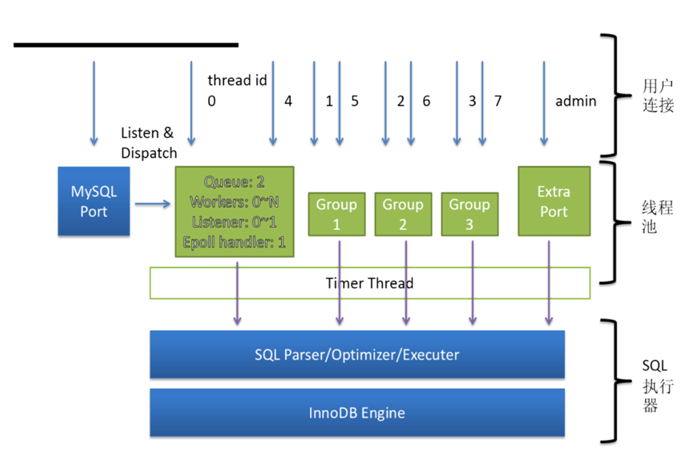

1. 创建多个 Group（thread_pool_size 参数指定，一般设置为 CPU core 数量），每个 Group 可有多个 worker；
2. 线程根据 connection id 被分配到 Group（生命周期内不变），worker 以 SQL 为单位进行处理，保证每个连接都能及时得到响应；
3. 每个 Group 有两个任务队列，优先队列：存放已开启事务的 SQL，保证事务优先被处理完（尽早释放锁）；优先队列为空时才处理普通队列；这样相比 MariaDB Thread Pool 的实现，优先队列可避免调度上的死锁（A 和 B 被分到不同的 Group 中，A 事务已经开启，并且获得了锁，可能无法立即得到调度执行，B 事务依赖 A 事务释放锁资源，但是先于 A 得到调度）；
4. 额外创建一个 Timer 线程，定期检查 Groups，若发现 woker 异常（堵塞/超时/worker 线程数目不够）则及时唤醒；
5. 若 Group 任务队列为空（客户端连接却不为空），为空闲连接设置一个超时期限，之后将连接的 socket fd 绑定到 Group 中的 epollfd，线程则调用 epoll_wait() 批量取任务。

 

MySQL 对于 CPU 的使用情况，在有些极端条件下，例如电子商务中的秒杀情形、关键节日集中庆祝的时刻及一些访问密集型业务，并发执行的 SQL 的需求很大，要保证在短时间内有巨大的吞吐量，就需要选择核心数多的 CPU。因此数据库服务器优选主频高、核数多的 CPU。

 

对于 MySQL 运行服务器 CPU 硬件优化总结如下：

1. 系统配置选择 Performance Per Watt Optimized（DAPC），发挥最大功耗性能，而不是节能模式（高运算节点禁用），节能模式在低高频性能转换时易出现Bug。
2. CPU优先选择高主频以提高运算能力；其次选择核数多，可以多线程并发处理和多实例部署。
3. 关闭 C1E（增强型空闲电源管理状态转换）和 C states，DB 服务器不需要节能和省电运行，默认是开启状态，DB 服务器建议关闭以提高 CPU 效率。
4. 数据库服务器选择高主频多核数 CPU 类型，同时开启最大性能和关闭 CPU CIE 和 C States。 高频加速 SQL 执行，多核解决并发。

## 内存

讲完 CPU 再了解如何从内存方向进行优化。

 

MySQL 对内存的运行需求是足够大的，单机多实例的情况内存建议按实际数据热点数据量的 30% 进行规划，单机单实例（即独享实例）的情况建议是分配 50%～80%。

MySQL 虽然有 Query Cache 但是功能很鸡肋，线上建议关闭 Query Cache，同时需要注意的是 MySQL 8.0 已移除 Query Cache。

 

MySQL 的内存分配原则取决于参数配置，详情在接下来的 MySQL 参数优化中讲解。

 

总结下 MySQL 对于内存的优化建议如下：

1. 内存频率选择 Maximum Performance（最佳性能)。
2. 大内存，renice mysql pid 避免 OOM 时 MySQL 被强杀。
3. 内存设置菜单中，启用 Node Interleaving 避免 NUMA 问题，同时建议修改系统配置关闭NUMA。

一句话描述，对于数据库服务器而言优先选择大内存，同时开启最大性能并关闭NUMA。

## 磁盘

接下来，来了解磁盘优化。

 

对于磁盘的硬件需求，数据库是 IO 型负载的软件，优先使用 SSD、PCIe SSD，迫不得已使用高转速机械硬盘，建议运行数据库时放弃使用机械硬盘。

 

从 IO 类型而言，MySQL Undo Log 是顺序写，随机读， Redo Log 和 Binlog 是顺序写顺序读，OLTP 场景以随机 IO 为主，OLAP 场景以顺序 IO 为主，其存储结构 MyISAM 是堆表、InnoDB 为索引组织表。

 

 

MySQL 对于磁盘的硬件优化原则。

1. RAID 策略选择： Sata SSD、PCIe SSD 无需 RAID，机械硬盘优先选择 RAID10，其次是 RAID5。
2. RAID CACHE & BBU 选择：购置阵列卡同时配备 CACHE 及 BBU 模块，可提升机械盘 IOPS，定期检查或监控 CACHE 及 BBU 模块的健康状况，确保意外时不至于丢失数据。
3. 磁盘类型选择：优先选择 SSD 或 PCIe SSD，机械盘使用高速硬盘。
4. 读写策略选择：有阵列卡时设置阵列写策略为 WB 或 Force WB with no battery，严禁 WT。同时关闭陈列预读策略，只用作写缓存。

# 参数优化

讲解完数据库服务器运行硬件优化后，接下来你将学习 MySQL 参数优化，方便我们进行参数调优。

 

MySQL 参数优化可以分为系统全局内存参数（SGA）和线程全局内存（PGA）。首先先聊下 SGA 系统全局内存分配的相关参数：

1. innodb_buffer_pool_size ，用于缓存行数据、索引数据，以及事务锁和自适应哈希等。 单机多实例的情况内存建议按实际数据热点数据量的30%规划，单机单实例（独享实例）的情况建议是分配50%～80%。
2. innodb_buffer_pool_instances，用于提升性能。
3. innodb_additional_mem_pool_size，用于缓存所有数据字典。
4. innodb_log_buffer_size ，InnoDB Redo日志缓冲，提高Redo日志写入效率。
5. key_buffer_size，MyISAM 表索引高速缓冲，提高 MyISAM 表索引读写效率。
6. query_cache_size，查询缓存，缓存相同SQL查询结果，提高查询结果返回效率，建议禁用。
7. table_cache && table_definiton_cache，表空间文件描述符缓存和表定义文件描述符缓存，提供数据表打开效率。

 

下图所示是 PGA 系统全局内存分配，这个是每个连接使用时需要申请对应的内存。使用默认参数值相加统计出每个连接线程占用的最大内存大小为 25MB， 线程级参数不宜设置过大。

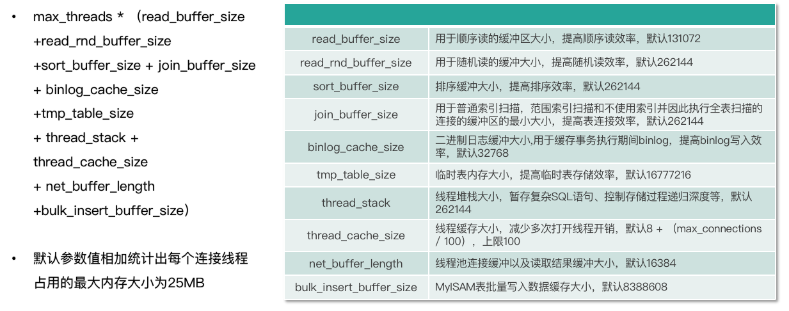

接下来我们从面试中经常关注的几个参数进行讲解。

## Redo Log

第一个参数是控制 Redo Log 刷盘策略的 innodb_flush_log_at_trx_commit，它有三个取值策略，如下图所示。

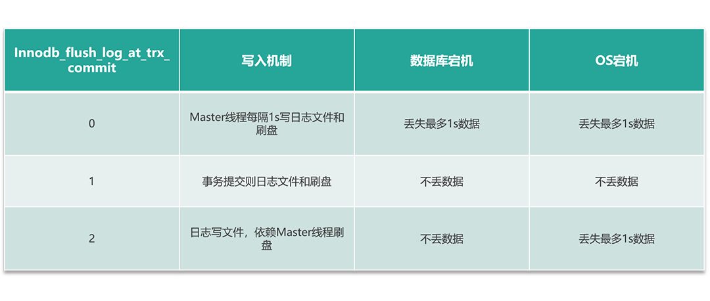

- 当取值为 0 ，表示事务提交时，MySQL 不会去处理日志缓存区（Log Buffer）的内容，也不会去处理日志文件的刷盘操作，由 MySQL 的后台 Master 线程每隔 1s 将缓存区的文件刷新到日志文件中。
- 当取值为 1 ，表示事务提交时，会将日志缓冲区的日志写入文件中，同时会刷新到磁盘中，保证数据库事务完全不会丢失。这种设置影响数据库性能。
- 当取值为 2，表示事务提交时，会将日志缓存区日志写入到文件中，但是不会刷新到磁盘中。由 MySQL 的后台 Master 线程每隔 1s 将系统缓存的日志文件刷新到磁盘中。

 

如下图，可以看到其不同取值时对应与日志缓冲区、OS cache、日志文件（ib_logfile）之间的关系。     

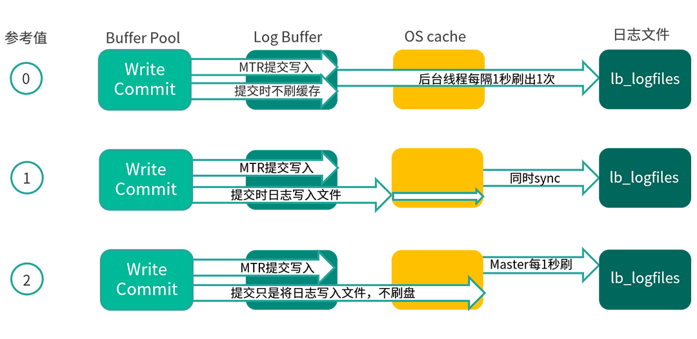

**Binlog**

**
**

第二个参数是控制 Binlog 刷盘策略的 sync_binlog，其取值分为 0、1、N（N>1）三类，如下图。

​    

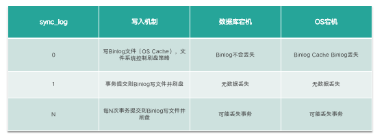  

1. 当取值为 0 时，事务提交时，MySQL 将 Binlog 信息写入 Binlog 文件（OS Cache）中，但是 MySQL不控制 Binlog 的刷磁盘操作，由文件系统自己控制其缓存的刷新。这是最危险的，一旦操作系统宕机，在 Binlog cache 中的所有 Binlog 都会丢失。如果只是数据库宕机，而操作系统未宕机，那么数据库所生成的 Binlog 都不会丢失。
2. 当取值为 1 时，每一个事务提交时，MySQL 都会把 Binlog 刷新到磁盘中。这样，数据库安全性最高，但是性能损耗也是最大的。如果这样设置的话，在数据库或操作系统宕机的情况下，二进制日志中缺少的任何事务也只能处于准备阶段，那么导致服务器自动恢复时，会回滚这些事务，保证无数据丢失。虽然 Binlog 是顺序 IO，但是多个事务同时提交，同样会对 MySQL 和 IO 的性能带来很大影响，不过 MySQL 可以通过 Group Commit 来缓解这种压力。
3. 当取值为 N 时，表示每 N 次事务提交，MySQL 调用文件系统的刷新操作将缓存刷新到磁盘中。如果数据库或操作系统在这个时候宕机，数据库可能会丢失一些事务。

## Log

接下来是关于 Log 相关参数的介绍，对于写入压力大的 OLTP 场景，扩容 Redo Log 有助于提升写入性能。主要关注的参数如下。

- innodb_flush_log_at_timeout：每隔 N 秒写入并刷新日志，默认为 1 即每秒 flush一次,可选 [1-2700]。该参数值允许增加 flush 之间的间隔以减少刷新，避免影响二进制日志组提交的性能。
- innodb_log_file_size：日志文件大小，建议设置1～2GB。
- innodb_log_files_in_group：日志文件组个数。

MySQL参数优化总结如下，你可以课后细看。

   

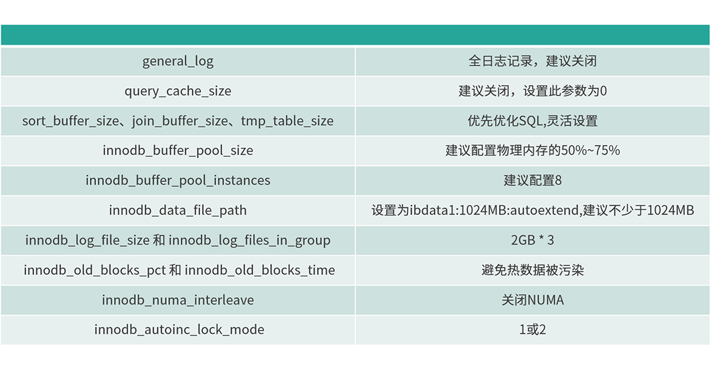

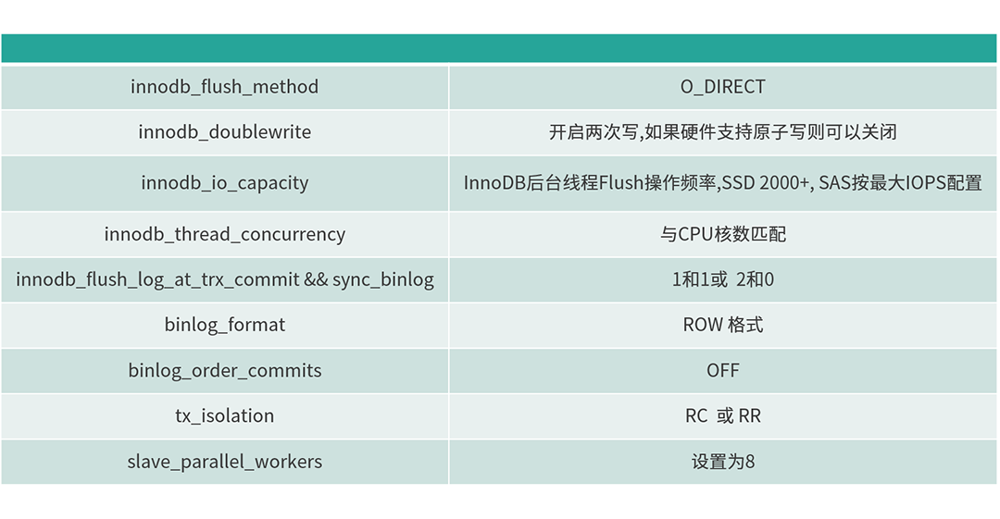

   

# Replication

至此，MySQL 运行的服务器环境和参数优化便完成了，那如何搭建高性能的 MySQL 架构呢？接下来我们说一下 MySQL 高可用架构的基础 Replication。

 

下图是 MySQL 复制的基本原理图，它描述了 Replication 的过程。  

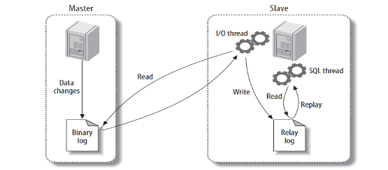

如图，它整体分为三个步骤：

1. 主库 Master 将数据库的变更操作记录在二进制日志 Binary Log 中。
2. 备库 Slave 读取主库上的日志并写入到本地中继日志 Relay Log 中。
3. 备库读取中继日志 Relay Log 中的 Event 事件在备库上进行重放 Replay。

 

整个过程涉及三个 Thread，分别是 Master 的 Binlog Dump Thred，和 Slave 的 I/O Thread 和 SQL Thread。

 

其具体参与主从复制的数据同步过程如下。

1. Master 服务器上对数据库的变更操作记录在 Binlog 中。
2. Master 的 Binlog Dump Thread 接到写入请求后读取 Binlog 推送给 Slave I/O Thread。
3. Slave I/O Thread 将读取的 Binlog 写入到本地 relay log 文件。
4. Slave SQL thread 检测到 relay log 的变更请求，解析 relay log 并在从库上进行应用。

 

以上整个复制过程都是异步操作，所以主从复制俗称异步复制，存在数据延迟。

Master 数据变更后记录 Binlog，只是通知 Binlog Dump Thread 有数据写入后就告诉存储引擎提交事务，并不会关注 Slave 是否接受并落地 Binlog Event。下图是异步复制的时序图。

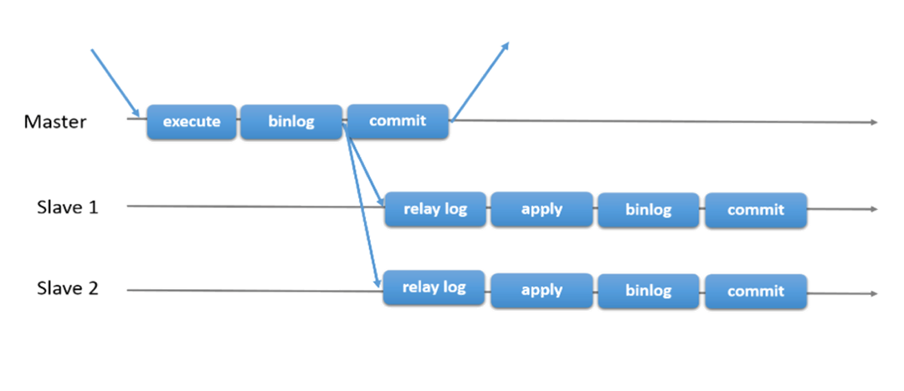

考虑到一个场景，主库正常写入数据并提交事务 T1，但是 Slave1 和 Slave2 由于某种原因（例如网络原因）一直无法接受到 Binlog Dump Thread Event 的推送请求，如果这时候 Master Crash，Slave 提升为 Master 后导致事务 T1 数据丢失。为了提升数据安全，MySQL 让 Master 在某一个时间点等待 Slave 节点的 ACK 消息后才进行事务提交，这也是半同步复制的基础。

 

MySQL 从 5.5 版本开始引入了半同步复制机制来降低数据丢失的概率，为什么是降低呢？原因除了 MySQL 半同步复制会退化成异步复制之外，还需要讲下半同步复制after commit 和增强半同步 after-sync 的实现。

 

介绍半同步复制之前先快速过一下 MySQL 事务写入碰到主从复制时的完整过程，主库事务写入分为 4 个步骤：

1. InnoDB Redo File Write (Prepare Write)；
2. Binlog File Flush & Sync to Binlog File；
3. InnoDB Redo File Commit（Commit Write）；
4. Send Binlog to Slave。

当 Master 不需要关注 Slave 是否接受到 Binlog Event 时，即为传统的主从复制。

当 Master 需要在第三步等待 Slave 返回 ACK 时，即为 after-commit。

当 Master 需要在第二步等待 Slave 返回 ACK 时，即为 after-sync。

## after_commit

首先介绍 after-commit。

 

MySQL Master 将事务写入 Binlog（sync_binlog=1）并推送给 Slave 后主库将事务提交到存储引擎（此时未返回客户端但是其他会话可以访问到事务提交信息），Slave  I/O Thread 将读取的 Binlog 写入到本地 relay log 文件（sync_relay=1）后向 Master 返回 ACK 消息，当主库 Master 等到 Slave 返回的 ACK 消息后 Master 将事务提交成功的结果返回给客户端。

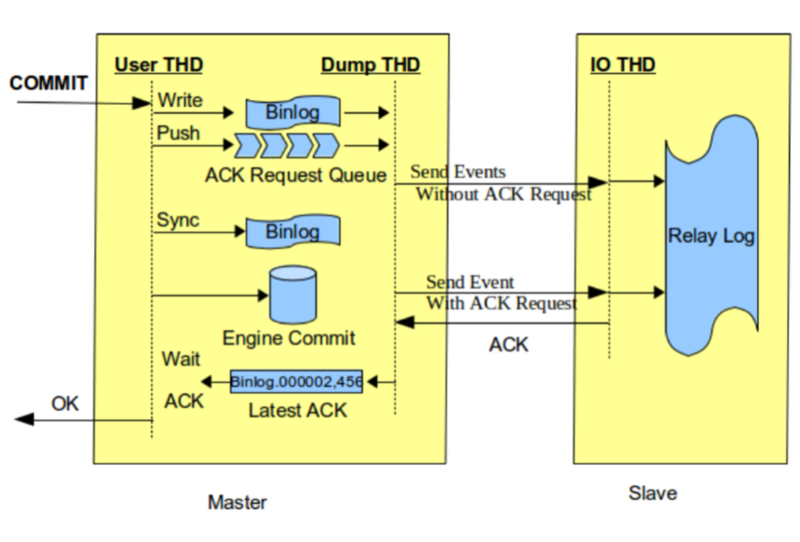

对于当前会话的客户端进行事务提交后，主库等待 ACK 的过程中有两种情况。

1. 事务还没发送到从库，主库 crash 并发起切换，从库为新主库。客户端收到事务提交失败的信息，需要重新提交该事务。
2. 事务已经发送到从库，主库 crash 并发起切换，从库为新主库。从库已经应用该事务并写入数据，但客户端连接重置同样会收到事务提交失败的信息，重新提交该事务时会报错数据已存在（如订单已提交成功）。

 

如下图所示，after-commit 的情况在非当前客户端访问数据时会出现“数据幻读”的情况，例如User1 想在 t1 表插入记录 3 并在存储引擎层提交事务，此时 User2 可以看到已经提交事务的数据记录 3。当时 Master 在等待 Slave 返回 ACK 的过程中 Crash 了并且 Slave也没有成功接受到 Binlog Event，此时 Slave 提升为 Master 时 User2 发现之前访问到的数据记录 3 又不见了。如果 Master Crash 后无法启动，那么提交的事务记录 3 在从库上永远找不到了，导致数据丢失。

​    

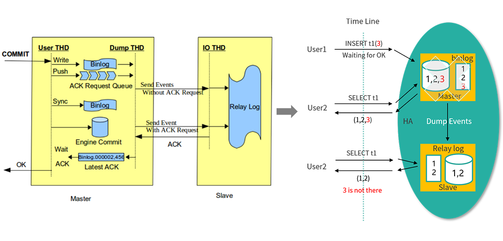

**after-sync**

**
**

讲完 after-commit，接下来我们讲 after_sync。

为了提升数据的安全性，MySQL 5.7 引入了增强半同步 after_sync（无损复制），并将其设置为默认的半同步方式来解决数据丢失的问题。

 

如下图，after-sync 是将 Master 等待 ACK 消息放到了 Binlog File Flush & Sync to Binlog File 之后，Engine Commit 之前，这样就可以保证数据不会丢失，因为 Slave 接受到event 并写入自身 relay log。

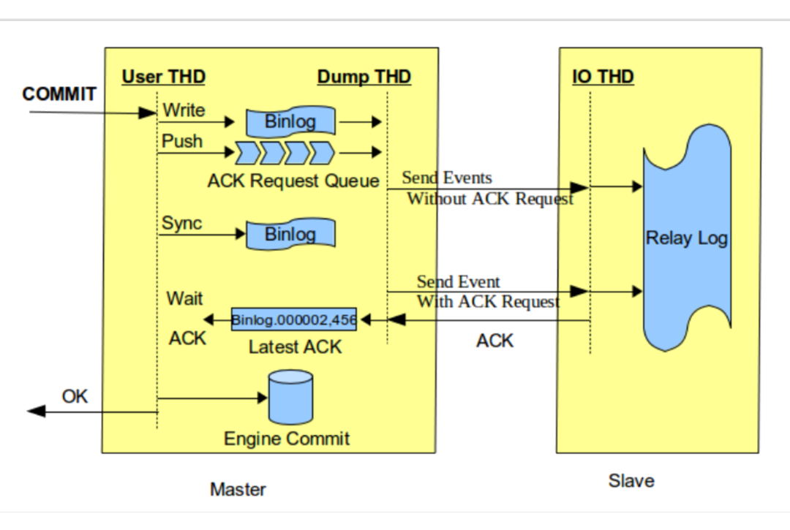

对于数据安全的场景，参数 innodb_flush_log_at_trx_commit 和 sync_log 配置为双一配合 after-sync 半同步模式是一个好的选择，这也是大部分金融场景的参数配置。

 

运维过程中有个关键点需要注意：当半同步等待 ACK 超时时，半同步复制会退化为异步复制，具体细节你在课后可以查看有关半同步相关参数的配置。

 

下图是 MySQL 官方对于半同步复制的时序图，主库等待从库写入 relay log 并返回 ACK 后才进行 Engine Commit。  

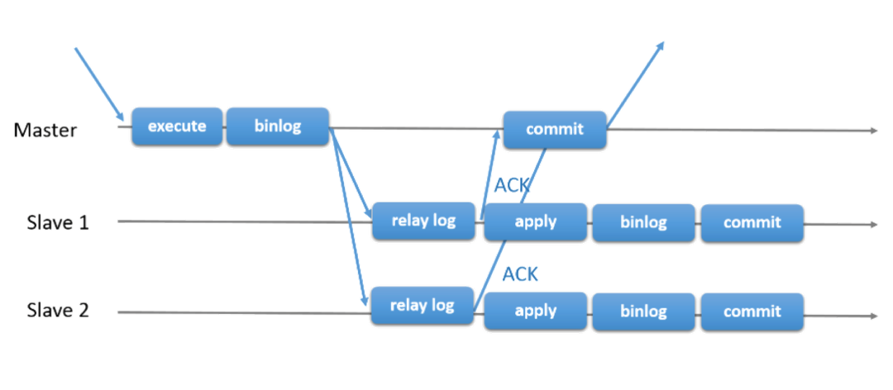

**Galera Cluster
**

**
**

上面讲的主从异步复制、半同步复制都属于异步复制，接下来聊聊同步复制（准同步）Galera Cluster 和 MySQL Group Replication。

 

最开始 Galera Cluster 的实现有两个，一个是 MariaDB 实现的 MariaDB  Galera Cluster - MGC；一个是 Percona 实现的 Percona XtraDB Cluster-PXC。    

   

通常由三个实例组成的一个集群，三个节点均可以提供读写，即常见的 Multi-Master 多主架构。客户端可以读写访问集群任意一个节点，集群节点间组成了 Group communication，如下图所示。这可以用来保证集群节点数据的强一致性，这种架构是 Share-Nothing，不共享数据、多副本的高冗余架构，拥有多点写入、同步复制、无复制延迟、并法复制、随意切换、节点自动配置、健康检查等功能。     

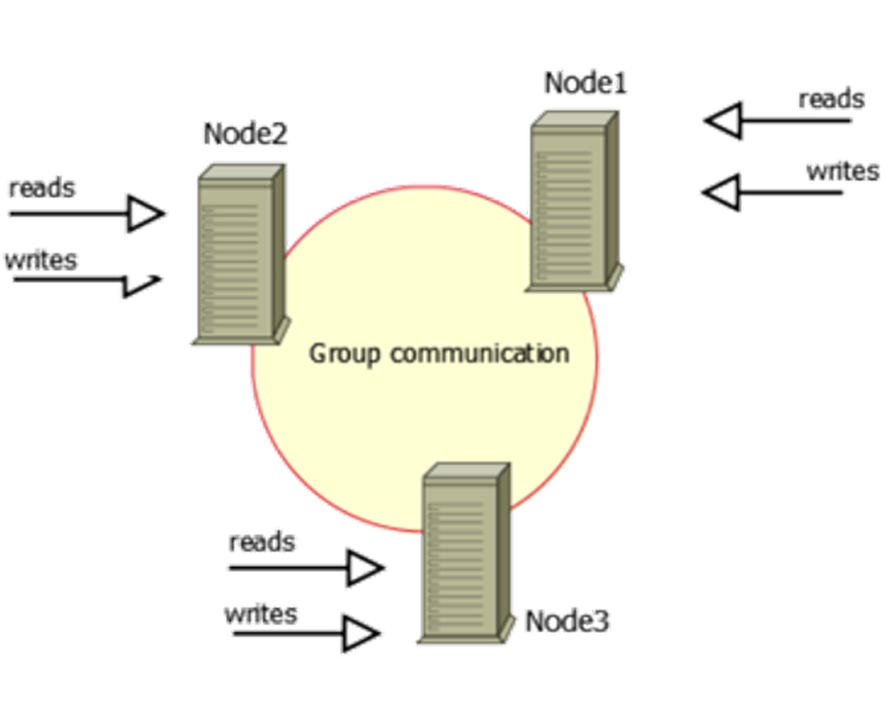

Group communication 的本质是 Galera Cluster，它来实现强一致性、支持多点写入的同步复制集群架构，Galera Cluter 提供了一系列的 API，为上层 MySQL 提供丰富的状态信息及回调函数，API 即 Write-Set Replication API，简称 wsrep API。通过这些API 来提供基于写集验证的乐观的同步复制，当一个节点组装完写集后，每个节点在复制事务时都会在组内广播写集并进行写集比对，如果没有冲突的话，那么 Galera Cluster 层对该写集对应的事务就可以继续提交或 APPLY，当数据库 MySQL 层得到Galera Cluster 层返回的回调状态信息后继续事务提交或回滚的操作。

 

Galera Cluster是一个强一致性集群，当集群节点有数据写入时，Group communication 会向组内所有成员广播写集（初步可简单理解为写入的Binlog），所有节点验证通过之后写节点开始提交，其他节点执行写集应用和提交，当出现数据冲突时则写节点执行回滚，其他节点丢弃该写集。

## MySQL Group Replication

MySQL 在 5.7 版本参考 Galera Cluster 的技术实现推出了 MySQL Group Replication（简称 MGR）。

 

MGR 同样是一个支持多点写入的多主复制架构，它基于原生 MySQL 主从复制的基础上构建组通信层，由 Group Replication 提供一组原子消息并且按照全局顺序进行消息传递，集群任何节点均可写入，但所有写入事务只有在获得复制组认证通过（多数派协议 Paxos）后才能进行提交。例如由若干个节点共同组成一个复制组，一个事务的提交必须经过组内大多数节点（N / 2 + 1）决议并通过，才能得以提交。

   

如下是 MySQL Group Replication /Galera Cluster 的时序图：由 3 个节点组成一个复制组，Consensus 层为一致性协议层，在事务提交过程中，发生组间通信，由 2 个节点决议（certify）通过这个事务，事务才能够最终得以提交并响应。     

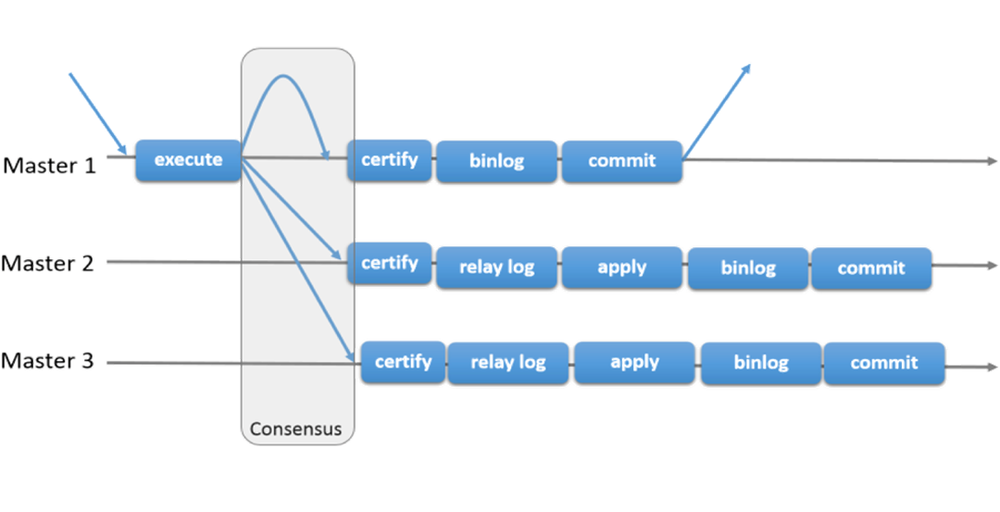

   

# 经典架构和适用场景

接下来聊一下经典架构和适用场景。

## 主从复制    

首先是基于主从构建的一主一从架构，应用程序读写直接访问 Master 或者配置 Master 和 Slave 的数据源进行人为的读写分离，当 Master 出现故障时需要人工维护介入。通常适合于轻量级程序、高可用要求不高的业务场景。如下图所示，这类架构中应用程序直连访问 Master 和 Slave 进行读写分离，当 Master 出现故障时由于无法自动切换导致服务受损。因此通常会基于此架构加上 VIP/DNS + Keepalived 及双主复制来做一个简单的高可用切换。

​    

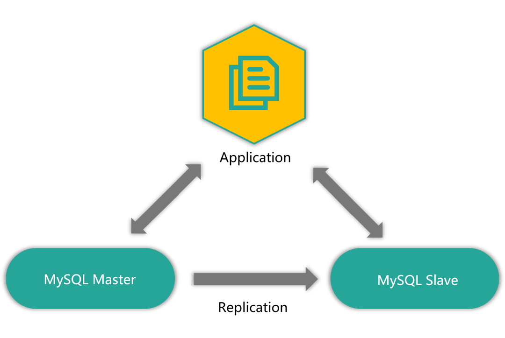

**双主复制**

**
**

随着业务的发展，架构由常见的主从演变为双主架构并引入高可用组件。

 

常见的使用方式是构建双主复制，其中一个 Master 提供线上服务，另一个 Master 作为 Standby 供高可用切换，Master 下游挂载 Slave 承担读请求。 高可用架构通常是配置 VIP/DNS+Keepalived 或使用业内早期的 MMM 架构。

​    

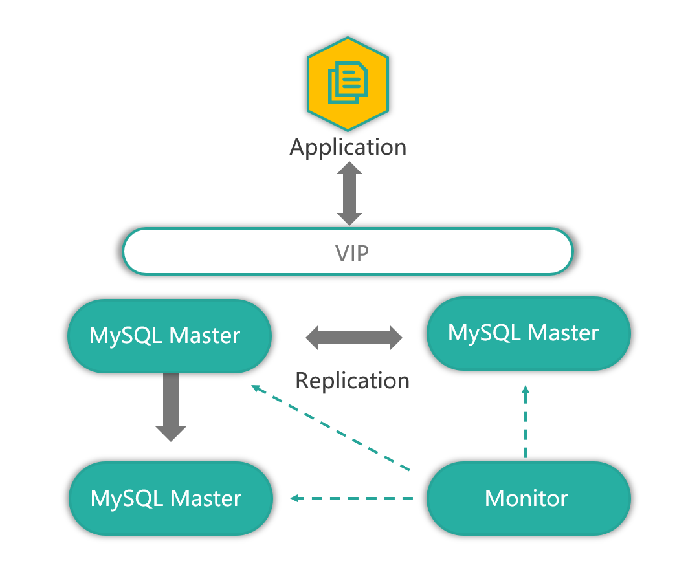

MMM 架构提供了单点判断的 Monitor，由它来判断 Master 的存活并进行 VIP 的漂移，MMM 的优点是基于 MySQL 原生复制，其工具集功能强大，提供了一套 HA、Failover 的 tools 来帮助运维。

 

MMM 缺点是架构比较落伍且长期不更新（导致很多 MySQL 的新特性无法支持，例如 GTID），同时由于 MMM 是单点判断并没有 watch dog 守护进程，对于网络分区或网络抖动的场景会出现集群脑裂，当出现业务在两边数据同时写入时会出现写入冲突甚至数据错乱的问题。最大的问题是 MMM 备选主延迟过大会导致无法切换，不提供 binlog 补偿的功能。

 

该架构不适用于对数据一致性要求高的业务场景，适用于能够容忍网络抖动导致数据冲突和不可用、容忍数据丢失的应用场景，其架构扩展和读写分离需要应用程序联调配合。

## 树形复制

 

通用的架构还有树形复制，也叫级联复制。这类架构通常适用于数据访问策略分层，例如 MySQL Master 和 MySQL Slave 参与线上业务访问及高可用切换，MySQL Statistic 节点提供离线查询、报表慢查和非线上业务访问，如下图。

​    

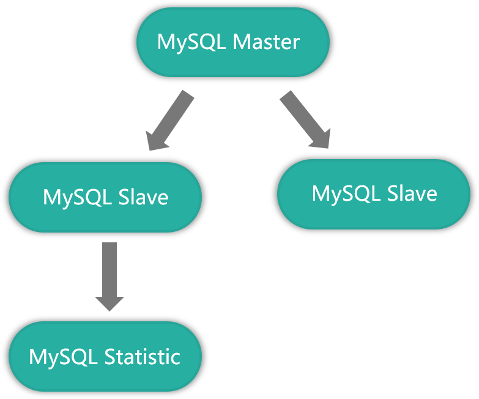

   

 

这类架构是业内常用的复制拓扑图，开启半同步复制及配置一套高可用切换工具即可应对大部分应用场景的访问需求。

## 环形复制

最后介绍下环形复制，基于原生 MySQL Replication 构建的环形复制由于构建费力不讨好、运维复杂不友好等原因不在介绍范围内，环形复制重点在于 MySQL Group Replication 和 Galera Cluster。

​    

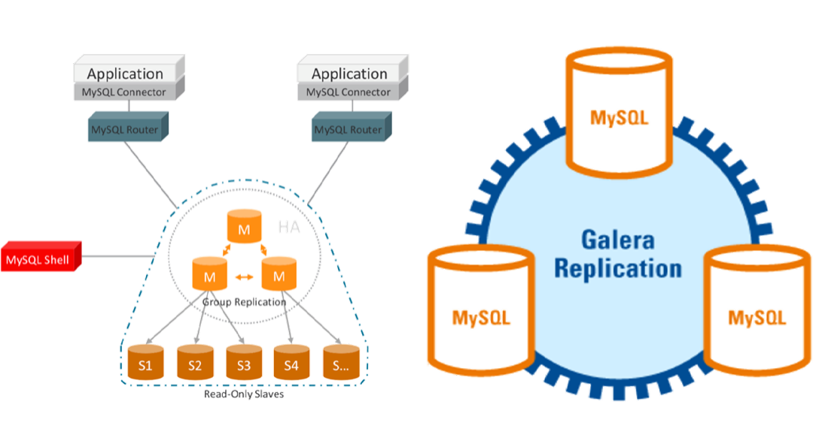

这两种架构均可满足保证集群节点数据强一致性、多点写入的需求，适用于金融场景及对数据一致性要求高的业务场景，根据成熟度和线上集群使用规模考虑，目前 MGR 线上运行较少，可以技术储备并关注官网信息，当前推进成熟的 Galera Cluster，按需选择 MariaDB  Galera Cluster -MGC 或 Percona XtraDB Cluster-PXC 即可。

 

至此，我们介绍了常见的一主一从、双主复制架构、树形复制架构和环形复制架构，对于实际工作中，高性能数据库架构是按需随机应变，架构是上层建筑，我们将底层的数据库服务器硬件优化好、MySQL 参数优化好及实现 MySQL 运维自动化后，就能构建整体的高性能数据库架构。

# 拓展：统一管理的数据库架构  

拓展下，对于不同业务使用的不同集群架构，如何统一集中管理呢？下图为你提供一个建议方案，仅供学习，具体详情可关注下一个课时“如何做到 MySQL 高可用“的讲解。

​    

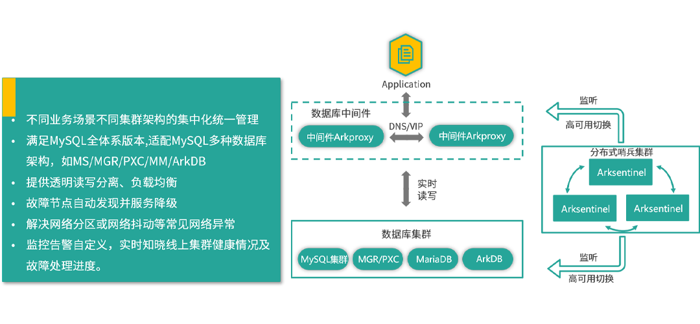

**总结回顾****
**

**
**

下面我们来回顾一下今天学习到的知识。

 

首先我们对数据库服务器硬件层次从CPU、内存、磁盘等运行环境进行了优化。然后学习了 MySQL 参数如何配置，重点参数如何调优。之后又学习了 MySQL 异步复制和半同步复制的原理。最后讲解了以 MySQL 复制为基础的主从复制架构、双主复制架构、树形复制架构及环形复制架构和使用场景。简单拓展了一下如何统一管理不同的数据库架构。

​    

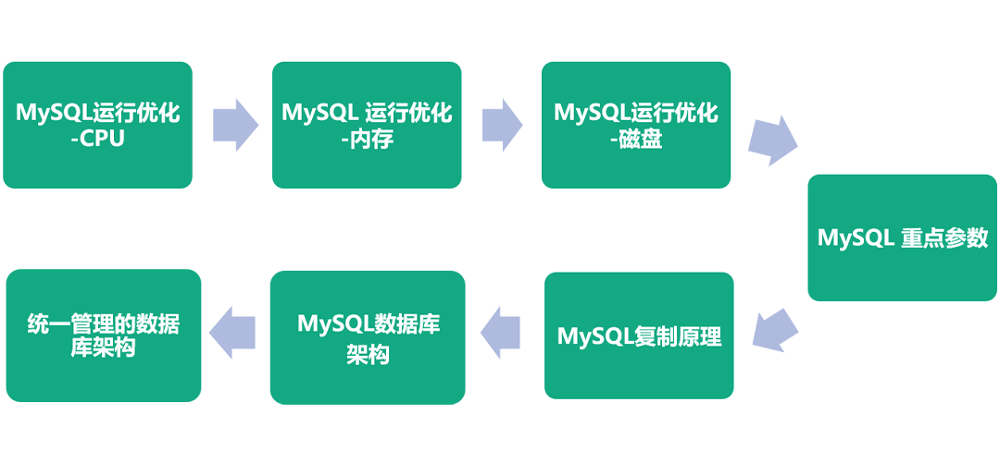

通过本次课程的学习，你需要对构建高性能数据库架构有总体的认识，需要知道从哪些细节点去考虑和优化。高性能架构需要不断的积累经验和实践，实践才能出真知，从需求中演变架构。

 

以上就是课时 6 的内容，下一课时，将分享“如何实现企业级 MySQL 高可用“的相关内容。

 

开篇寄语：建立完整的MySQL知识体系

06:31

 高性能MySQL实战

 