# RabbitMQ

[TOC]


# 0. 学习目标

- 能够说出什么是消息中间件
- 能够安装RabbitMQ
- 能够编写RabbitMQ的入门程序
- 能够说出RabbitMQ的5种模式特征
- 能够使用Spring整合RabbitMQ


RabbitMQ   MQ 


# 1. 消息中间件概述

## 1.1. 什么是消息中间件

MQ全称为Message Queue（消息队列），是在消息的传输过程中保持消息的容器。多用于分布式系统之间进行通信。

分布式系统通信

直接远程调用


A系统  远程调用  B系统

A系统  MQ　B系统   A、B之间的间接通信

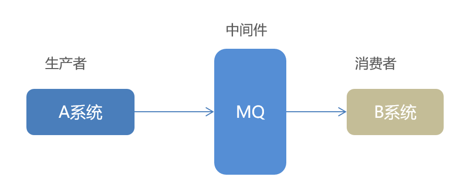

生产者　中间件 消费者 

小结

MQ 消息队列 存储消息的中间件

分布式系统通信两种方式 直接远程调用 和 借助第三方 完成间接通信

发送方称为生产者  接收方称为消费者

消息队列是应用程序和应用程序之间的通信方法。

 

MQ的优势和劣势

优势

* 应用解耦

* 异步提速

* 削峰填谷

劣势

* 系统可用性降低

* 系统复杂度提高

* 一致性问题

解耦   耦合性

系统的耦合性越高，容错性就越低，可维护性就越低。

需求变化  代码不停的修改    耦合在一起

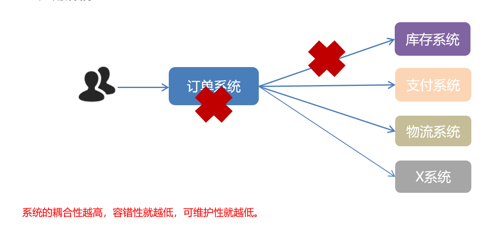


使用 MQ 使得应用间解耦，提升容错性和可维护性。

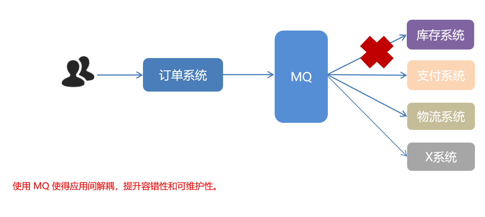

隔离 

下单链路上 


同步完成 

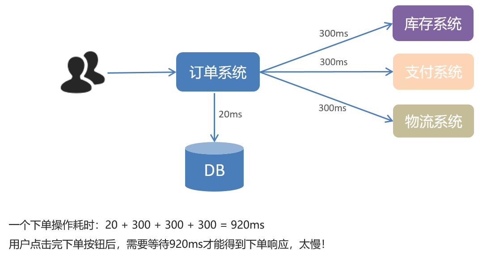

一个下单操作耗时：20 + 300 + 300 + 300 = 920ms

用户点击完下单按钮后，需要等待920ms才能得到下单响应，太慢！


无感知 

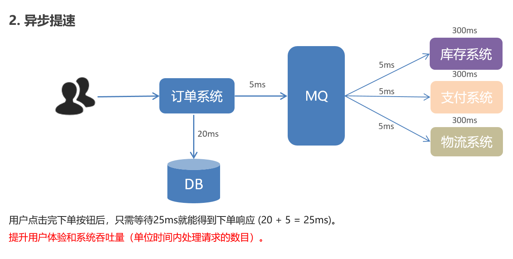

用户点击完下单按钮后，只需等待25ms就能得到下单响应 (20 + 5 = 25ms)。

提升用户体验和系统吞吐量（单位时间内处理请求的数目）。

处理数目 吞吐量大大提高了  


**削峰填谷**

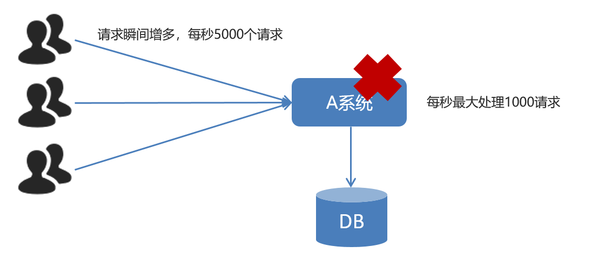

秒杀活动 流量请求  瞬间增多 宕机  不可用了


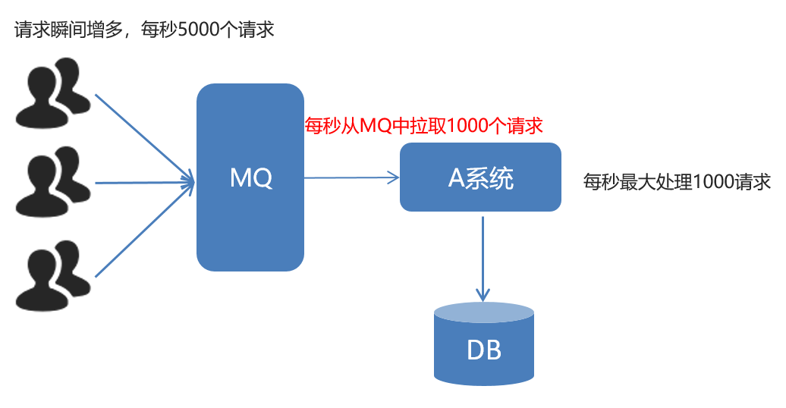

信息队列   MQ   小意思    可以承担这么多请求 

削峰 

积压了好多  慢慢消费掉   消息积压 

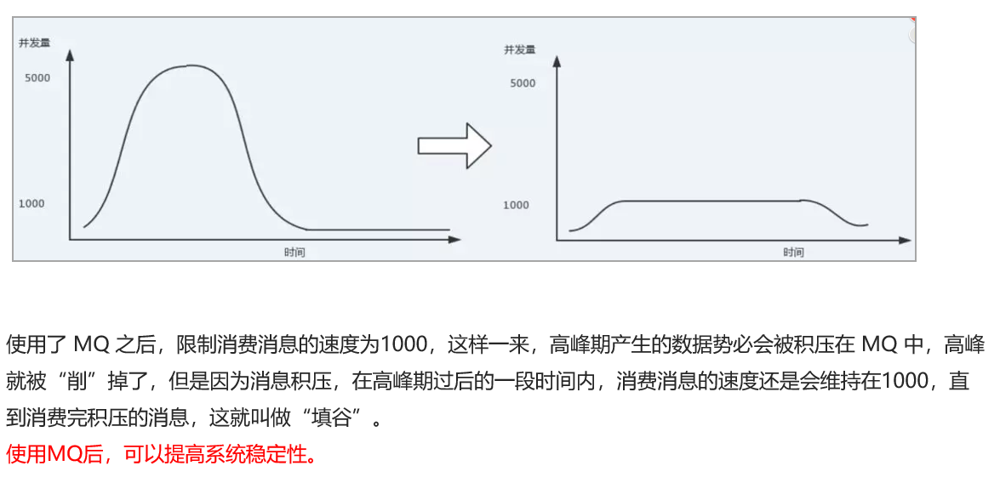

使用了 MQ 之后，限制消费消息的速度为1000，这样一来，高峰期产生的数据势必会被积压在 MQ 中，高峰就被“削”掉了，但是因为消息积压，在高峰期过后的一段时间内，消费消息的速度还是会维持在1000，直到消费完积压的消息，这就叫做“填谷”。

使用MQ后，可以提高系统稳定性。

**小结**

应用解耦：提高系统容错性和可维护性
异步提速：提升用户体验和系统吞吐量
削峰填谷：提高系统稳定性

劣势

* 系统可用性降低

* 系统复杂度提高

* 一致性问题

缺点 

问题处理方案


系统可用性降低
系统引入的外部依赖越多，系统稳定性越差。一旦 MQ 宕机，就会对业务造成影响。如何保证MQ的高可用？

要保证MQ也没问题 MQ宕机

系统复杂度提高
MQ 的加入大大增加了系统的复杂度，以前系统间是同步的远程调用，现在是通过 MQ 进行异步调用。如何保证消息没有被重复消费？怎么处理消息丢失情况？那么保证消息传递的顺序性？

一致性问题
A 系统处理完业务，通过 MQ 给B、C、D三个系统发消息数据，如果 B 系统、C 系统处理成功，D 系统处理失败。如何保证消息数据处理的一致性？

强大 重要 复杂 

**小结**

既然 MQ 有优势也有劣势，那么使用 MQ 需要满足什么条件呢？

①生产者不需要从消费者处获得反馈。引入消息队列之前的直接调用，其接口的返回值应该为空，这才让明明下层的动作还没做，上层却当成动作做完了继续往后走，即所谓异步成为了可能。

②容许短暂的不一致性。

③确实是用了有效果。即解耦、提速、削峰这些方面的收益，超过加入MQ，管理MQ这些成本。

简单 复杂 

**常见的** **MQ** **产品**

目前业界有很多的 MQ 产品，例如 RabbitMQ、RocketMQ、ActiveMQ、Kafka、ZeroMQ、MetaMq等，也有直接使用 Redis 充当消息队列的案例，而这些消息队列产品，各有侧重，在实际选型时，需要结合自身需求及 MQ 产品特征，综合考虑。

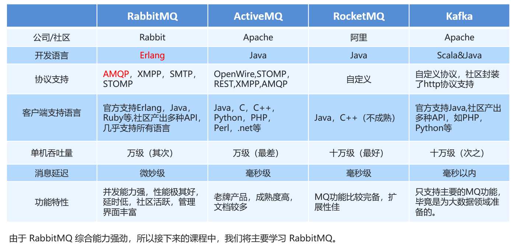

Erlang

综合能力强劲  学习RabbitMQ

- 为什么使用MQ

  在项目中，可将一些无需即时返回且耗时的操作提取出来，进行**异步处理**，而这种异步处理的方式大大的节省了服务器的请求响应时间，从而**提高**了**系统**的**吞吐量**。

  

- 开发中消息队列通常有如下应用场景：
  
  1、任务**异步**处理
  
  将不需要同步处理的并且耗时长的操作由消息队列通知消息接收方进行异步处理。提高了应用程序的响应时间。
  
  2、应用程序**解耦合**
  
  MQ相当于一个中介，生产方通过MQ与消费方交互，它将应用程序进行解耦合。
  
  3、**削峰填谷**
  
  如订单系统，在下单的时候就会往数据库写数据。但是数据库只能支撑每秒1000左右的并发写入，并发量再高就容易宕机。低峰期的时候并发也就100多个，但是在高峰期时候，并发量会突然激增到5000以上，这个时候数据库肯定卡死了。
  
  
  
  消息被MQ保存起来了，然后系统就可以按照自己的消费能力来消费，比如每秒1000个数据，这样慢慢写入数据库，这样就不会卡死数据库了。
  
  
  
  但是使用了MQ之后，限制消费消息的速度为1000，但是这样一来，高峰期产生的数据势必会被积压在MQ中，高峰就被“削”掉了。但是因为消息积压，在高峰期过后的一段时间内，消费消息的速度还是会维持在1000QPS，直到消费完积压的消息,这就叫做“填谷”
  
  


## 1.2. AMQP 和 JMS

MQ是消息通信的模型；实现MQ的大致有两种主流方式：AMQP、JMS。

### 1.2.1. AMQP

AMQP是一种协议，更准确的说是一种binary wire-level protocol（链接协议）。这是其和JMS的本质差别，AMQP不从API层进行限定，而是直接定义网络交换的数据格式。

AMQP，即 Advanced Message Queuing Protocol（高级消息队列协议），是一个网络协议，是应用层协议的一个开放标准，为面向消息的中间件设计。基于此协议的客户端与消息中间件可传递消息，并不受客户端/中间件不同产品，不同的开发语言等条件的限制。2006年，AMQP 规范发布。类比HTTP。

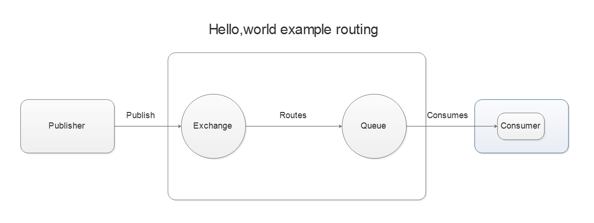

### 1.2.2. JMS

JMS即Java消息服务（JavaMessage Service）应用程序接口，是一个Java平台中关于面向消息中间件（MOM）的API，用于在两个应用程序之间，或分布式系统中发送消息，进行异步通信。

 JMS 即 Java 消息服务（JavaMessage Service）应用程序接口，是一个 Java 平台中关于面向消息中间件的API
 JMS 是 JavaEE 规范中的一种，类比JDBC
 很多消息中间件都实现了JMS规范，例如：ActiveMQ。RabbitMQ 官方没有提供 JMS 的实现包，但是开源社区有


小结

1.RabbitMQ 是基于 AMQP 协议使用 Erlang 语言开发的一款消息队列产品。

2.RabbitMQ提供了6种工作模式，我们学习5种。这是今天的重点。

3.AMQP 是协议，类比HTTP。

4.JMS 是 API 规范接口，类比 JDBC。

### 1.2.3. AMQP 与 JMS 区别

- JMS是定义了统一的接口，来对消息操作进行统一；AMQP是通过规定协议来统一数据交互的格式
- JMS限定了必须使用Java语言；AMQP只是协议，不规定实现方式，因此是跨语言的。
- JMS规定了两种消息模式；而AMQP的消息模式更加丰富


## 1.3. 消息队列产品

市场上常见的消息队列有如下：

- ActiveMQ：基于JMS
- ZeroMQ：基于C语言开发
- RabbitMQ：基于AMQP协议，erlang语言开发，稳定性好
- RocketMQ：基于JMS，阿里巴巴产品
- Kafka：类似MQ的产品；分布式消息系统，高吞吐量


## 1.4. RabbitMQ

RabbitMQ是由erlang语言开发，基于AMQP（Advanced Message Queue 高级消息队列协议）协议实现的消息队列，它是一种应用程序之间的通信方法，消息队列在分布式系统开发中应用非常广泛。

RabbitMQ官方地址：http://www.rabbitmq.com/

2007年，Rabbit 技术公司基于 AMQP 标准开发的 RabbitMQ 1.0 发布。RabbitMQ 采用 Erlang 语言开发。Erlang 语言由 Ericson 设计，专门为开发高并发和分布式系统的一种语言，在电信领域使用广泛。

RabbitMQ 基础架构如下图：


channel 管道 

Virtual

Exchange Queue


RabbitMQ 中的相关概念：

Broker：接收和分发消息的应用，RabbitMQ Server就是 Message Broker
Virtual host：出于多租户和安全因素设计的，把 AMQP 的基本组件划分到一个虚拟的分组中，类似于网络中的 namespace 概念。当多个不同的用户使用同一个 RabbitMQ server 提供的服务时，可以划分出多个vhost，每个用户在自己的 vhost 创建 exchange／queue 等
Connection：publisher／consumer 和 broker 之间的 TCP 连接
Channel：如果每一次访问 RabbitMQ 都建立一个 Connection，在消息量大的时候建立 TCP Connection的开销将是巨大的，效率也较低。Channel 是在 connection 内部建立的逻辑连接，如果应用程序支持多线程，通常每个thread创建单独的 channel 进行通讯，AMQP method 包含了channel id 帮助客户端和message broker 识别 channel，所以 channel 之间是完全隔离的。Channel 作为轻量级的 Connection 极大减少了操作系统建立 TCP connection 的开销

Exchange：message 到达 broker 的第一站，根据分发规则，匹配查询表中的 routing key，分发消息到queue 中去。常用的类型有：direct (point-to-point), topic (publish-subscribe) and fanout (multicast)
Queue：消息最终被送到这里等待 consumer 取走
Binding：exchange 和 queue 之间的虚拟连接，binding 中可以包含 routing key。Binding 信息被保存到 exchange 中的查询表中，用于 message 的分发依据


RabbitMQ提供了6种模式：简单模式，work模式（work queues），Publish/Subscribe发布与订阅模式，Routing路由模式，Topics主题模式，RPC远程调用模式（远程调用，不太算MQ；暂不作介绍）；

官网对应模式介绍：https://www.rabbitmq.com/getstarted.html


# 2. 安装及配置RabbitMQ

详细查看 `资料/软件/安装RabbitMQ.md` 文档。

RabbitMQ 官方地址：http://www.rabbitmq.com/
安装文档：资料/软件/安装 RabbitMQ.md

Linux

安装与配置


兔子发红包  发消息

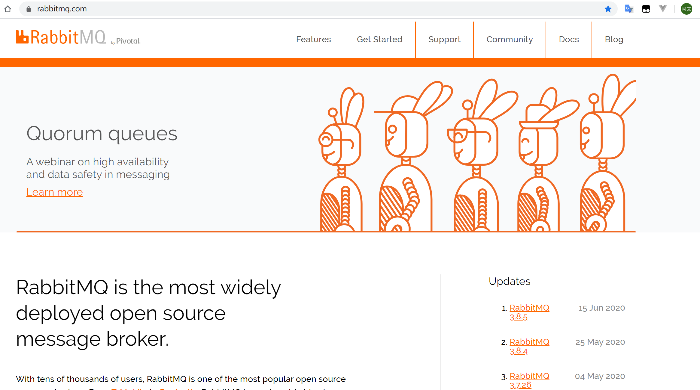


https://www.rabbitmq.com/#getstarted


下载安装

https://www.rabbitmq.com/download.html


# 3. RabbitMQ入门

## 3.1. 搭建示例工程

入门程序

需求：使用简单模式完成消息传递

步骤：

①创建工程（生产者、消费者）

②分别添加依赖

③编写生产者发送消息

④编写消费者接收消息

### 3.1.1. 创建工程


### 3.1.2. 添加依赖

往heima-rabbitmq的pom.xml文件中添加如下依赖：

```xml
        <dependency>
            <groupId>com.rabbitmq</groupId>
            <artifactId>amqp-client</artifactId>
            <version>5.6.0</version>
        </dependency>
```


## 3.2. 编写生产者

编写消息生产者com.itheima.rabbitmq.simple.Producer

```java
package com.itheima.rabbitmq.simple;

import com.rabbitmq.client.Channel;
import com.rabbitmq.client.Connection;
import com.rabbitmq.client.ConnectionFactory;

public class Producer {

    static final String QUEUE_NAME = "simple_queue";

    public static void main(String[] args) throws Exception {
        //创建连接工厂
        ConnectionFactory connectionFactory = new ConnectionFactory();
        //主机地址;默认为 localhost
        connectionFactory.setHost("localhost");
        //连接端口;默认为 5672
        connectionFactory.setPort(5672);
        //虚拟主机名称;默认为 /
        connectionFactory.setVirtualHost("/itcast");
        //连接用户名；默认为guest
        connectionFactory.setUsername("heima");
        //连接密码；默认为guest
        connectionFactory.setPassword("heima");

        //创建连接
        Connection connection = connectionFactory.newConnection();

        // 创建频道
        Channel channel = connection.createChannel();

        // 声明（创建）队列
        /**
         * 参数1：队列名称
         * 参数2：是否定义持久化队列
         * 参数3：是否独占本次连接
         * 参数4：是否在不使用的时候自动删除队列
         * 参数5：队列其它参数
         */
        channel.queueDeclare(QUEUE_NAME, true, false, false, null);

        // 要发送的信息
        String message = "你好；小兔子！";
        /**
         * 参数1：交换机名称，如果没有指定则使用默认Default Exchage
         * 参数2：路由key,简单模式可以传递队列名称
         * 参数3：消息其它属性
         * 参数4：消息内容
         */
        channel.basicPublish("", QUEUE_NAME, null, message.getBytes());
        System.out.println("已发送消息：" + message);

        // 关闭资源
        channel.close();
        connection.close();
    }
}

```


my

```java
package cn.liuawen.producer;

/**
 * @author : Liu Awen Email:willowawen@gmail.com
 * @create : 2020-06-30
 */

import com.rabbitmq.client.Channel;
import com.rabbitmq.client.Connection;
import com.rabbitmq.client.ConnectionFactory;

import java.io.IOException;
import java.util.concurrent.TimeoutException;

/**
 * 发送消息
 */

public class Producer_HelloWorld {
    public static void main(String[] args) throws IOException, TimeoutException {


        //1.创建连接工厂
        ConnectionFactory factory = new ConnectionFactory();
        //2. 设置参数
        //我设置的 http://39.99.254.180:15672/
        factory.setHost("39.99.254.180");//ip  默认值 localhost
        factory.setPort(5672); //端口  默认值 5672
        factory.setVirtualHost("/liuawen");//虚拟机 默认值/
        factory.setUsername("liuawen");//用户名 默认 guest
        factory.setPassword("liuawen");//密码 默认值 guest
        //3. 创建连接 Connection
        Connection connection = factory.newConnection();
        //4. 创建Channel
        Channel channel = connection.createChannel();
        //5. 创建队列Queue
        /*
        queueDeclare(String queue, boolean durable, boolean exclusive, boolean autoDelete, Map<String, Object> arguments)
        参数：
            1. queue：队列名称
            2. durable:是否持久化，当mq重启之后，还在
            3. exclusive：
                * 是否独占。只能有一个消费者监听这队列
                * 当Connection关闭时，是否删除队列
                *
            4. autoDelete:是否自动删除。当没有Consumer时，自动删除掉
            5. arguments：参数。

         */
        //如果没有一个名字叫hello_world的队列，则会创建该队列，如果有则不会创建
        channel.queueDeclare("hello_world",true,false,false,null);
        /*
        basicPublish(String exchange, String routingKey, BasicProperties props, byte[] body)
        参数：
            1. exchange：交换机名称。简单模式下交换机会使用默认的 ""
            2. routingKey：路由名称
            3. props：配置信息
            4. body：发送消息数据

         */

        String body = "hello rabbitmq~~~";

        //6. 发送消息
        channel.basicPublish("","hello_world",null,body.getBytes());


        //7.释放资源
        channel.close();
        connection.close();

    }
}

```


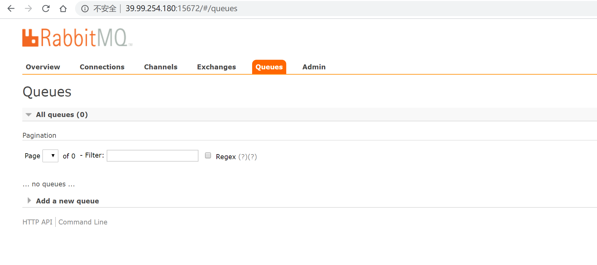

运行一下

```sh
SLF4J: Failed to load class "org.slf4j.impl.StaticLoggerBinder".
SLF4J: Defaulting to no-operation (NOP) logger implementation
SLF4J: See http://www.slf4j.org/codes.html#StaticLoggerBinder for further details.

Process finished with exit code 0
```


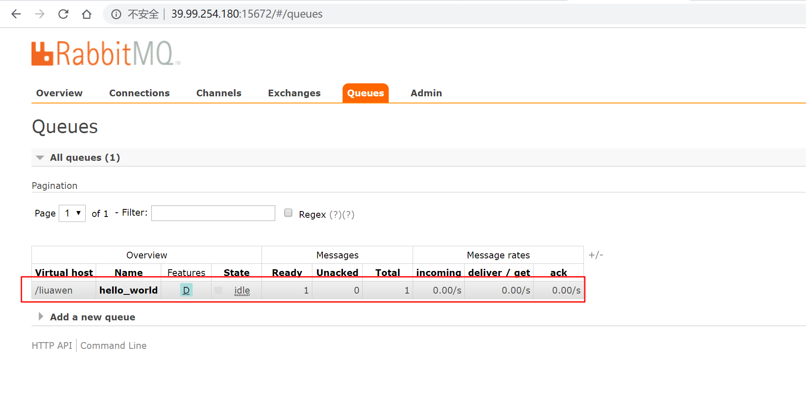


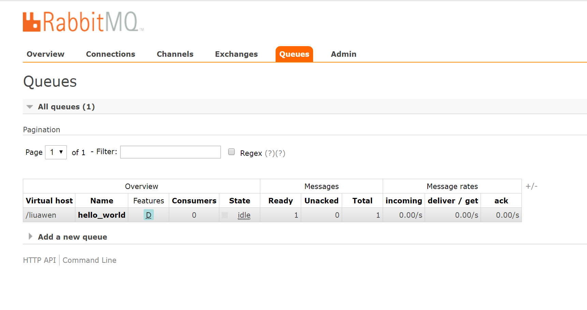

channel  connection 都关了

我不关呢？ 注释

有连接  有channel


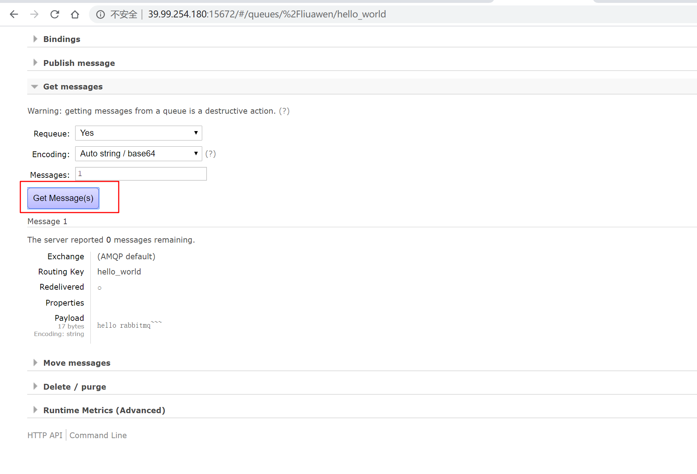


在执行上述的消息发送之后；可以登录rabbitMQ的管理控制台，可以发现队列和其消息：


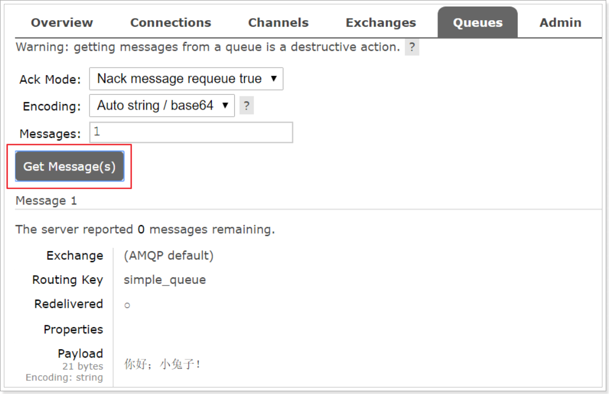

## 3.3. 编写消费者

抽取创建connection的工具类com.itheima.rabbitmq.util.ConnectionUtil；

```java
package com.itheima.rabbitmq.util;

import com.rabbitmq.client.Connection;
import com.rabbitmq.client.ConnectionFactory;

public class ConnectionUtil {

    public static Connection getConnection() throws Exception {
        //创建连接工厂
        ConnectionFactory connectionFactory = new ConnectionFactory();
        //主机地址;默认为 localhost
        connectionFactory.setHost("localhost");
        //连接端口;默认为 5672
        connectionFactory.setPort(5672);
        //虚拟主机名称;默认为 /
        connectionFactory.setVirtualHost("/itcast");
        //连接用户名；默认为guest
        connectionFactory.setUsername("heima");
        //连接密码；默认为guest
        connectionFactory.setPassword("heima");

        //创建连接
        return connectionFactory.newConnection();
    }

}

```


编写消息的消费者com.itheima.rabbitmq.simple.Consumer

```java
package com.itheima.rabbitmq.simple;

import com.itheima.rabbitmq.util.ConnectionUtil;
import com.rabbitmq.client.*;

import java.io.IOException;

public class Consumer {

    public static void main(String[] args) throws Exception {
        Connection connection = ConnectionUtil.getConnection();

        // 创建频道
        Channel channel = connection.createChannel();

        // 声明（创建）队列
        /**
         * 参数1：队列名称
         * 参数2：是否定义持久化队列
         * 参数3：是否独占本次连接
         * 参数4：是否在不使用的时候自动删除队列
         * 参数5：队列其它参数
         */
        channel.queueDeclare(Producer.QUEUE_NAME, true, false, false, null);

        //创建消费者；并设置消息处理
        DefaultConsumer consumer = new DefaultConsumer(channel){
            @Override
            /**
             * consumerTag 消息者标签，在channel.basicConsume时候可以指定
             * envelope 消息包的内容，可从中获取消息id，消息routingkey，交换机，消息和重传标志(收到消息失败后是否需要重新发送)
             * properties 属性信息
             * body 消息
             */
            public void handleDelivery(String consumerTag, Envelope envelope, AMQP.BasicProperties properties, byte[] body) throws IOException {
                //路由key
                System.out.println("路由key为：" + envelope.getRoutingKey());
                //交换机
                System.out.println("交换机为：" + envelope.getExchange());
                //消息id
                System.out.println("消息id为：" + envelope.getDeliveryTag());
                //收到的消息
                System.out.println("接收到的消息为：" + new String(body, "utf-8"));
            }
        };
        //监听消息
        /**
         * 参数1：队列名称
         * 参数2：是否自动确认，设置为true为表示消息接收到自动向mq回复接收到了，mq接收到回复会删除消息，设置为false则需要手动确认
         * 参数3：消息接收到后回调
         */
        channel.basicConsume(Producer.QUEUE_NAME, true, consumer);

        //不关闭资源，应该一直监听消息
        //channel.close();
        //connection.close();
    }
}
```


```sh
SLF4J: Failed to load class "org.slf4j.impl.StaticLoggerBinder".
SLF4J: Defaulting to no-operation (NOP) logger implementation
SLF4J: See http://www.slf4j.org/codes.html#StaticLoggerBinder for further details.
consumerTag：amq.ctag-hvie61k1SqFB655rv3nPHQ
Exchange：
RoutingKey：hello_world
properties：#contentHeader<basic>(content-type=null, content-encoding=null, headers=null, delivery-mode=null, priority=null, correlation-id=null, reply-to=null, expiration=null, message-id=null, timestamp=null, type=null, user-id=null, app-id=null, cluster-id=null)
body：hello rabbitmq~~~
```


## 3.4. 小结

上述的入门案例中中其实使用的是如下的简单模式：


在上图的模型中，有以下概念：

- P：生产者，也就是要发送消息的程序
- C：消费者：消息的接受者，会一直等待消息到来。
- queue：消息队列，图中红色部分。类似一个邮箱，可以缓存消息；生产者向其中投递消息，消费者从其中取出消息。


# 4. AMQP

## 4.1. 相关概念介绍

AMQP  一个提供统一消息服务的应用层标准高级消息队列协议，是应用层协议的一个开放标准，为面向消息的中间件设计。

AMQP是一个二进制协议，拥有一些现代化特点：多信道、协商式，异步，安全，扩平台，中立，高效。

RabbitMQ是AMQP协议的Erlang的实现。

| 概念           | 说明                                                         |
| -------------- | ------------------------------------------------------------ |
| 连接Connection | 一个网络连接，比如TCP/IP套接字连接。                         |
| 会话Session    | 端点之间的命名对话。在一个会话上下文中，保证“恰好传递一次”。 |
| 信道Channel    | 多路复用连接中的一条独立的双向数据流通道。为会话提供物理传输介质。 |
| 客户端Client   | AMQP连接或者会话的发起者。AMQP是非对称的，客户端生产和消费消息，服务器存储和路由这些消息。 |
| 服务节点Broker | 消息中间件的服务节点；一般情况下可以将一个RabbitMQ Broker看作一台RabbitMQ 服务器。 |
| 端点           | AMQP对话的任意一方。一个AMQP连接包括两个端点（一个是客户端，一个是服务器）。 |
| 消费者Consumer | 一个从消息队列里请求消息的客户端程序。                       |
| 生产者Producer | 一个向交换机发布消息的客户端应用程序。                       |

## 4.2. RabbitMQ运转流程

在入门案例中：

- 生产者发送消息
  1. 生产者创建连接（Connection），开启一个信道（Channel），连接到RabbitMQ Broker；
  2. 声明队列并设置属性；如是否排它，是否持久化，是否自动删除；
  3. 将路由键（空字符串）与队列绑定起来；
  4. 发送消息至RabbitMQ Broker；
  5. 关闭信道；
  6. 关闭连接；
- 消费者接收消息
  1. 消费者创建连接（Connection），开启一个信道（Channel），连接到RabbitMQ Broker
  2. 向Broker 请求消费相应队列中的消息，设置相应的回调函数；
  3. 等待Broker回应闭关投递响应队列中的消息，消费者接收消息；
  4. 确认（ack，自动确认）接收到的消息；
  5. RabbitMQ从队列中删除相应已经被确认的消息；
  6. 关闭信道；
  7. 关闭连接；


## 4.3. 生产者流转过程说明

1. 客户端与代理服务器Broker建立连接。会调用newConnection() 方法,这个方法会进一步封装Protocol Header 0-9-1 的报文头发送给Broker ，以此通知Broker 本次交互采用的是AMQPO-9-1 协议，紧接着Broker 返回Connection.Start 来建立连接，在连接的过程中涉及Connection.Start/.Start-OK 、Connection.Tune/.Tune-Ok ，Connection.Open/ .Open-Ok 这6 个命令的交互。
2. 客户端调用connection.createChannel方法。此方法开启信道，其包装的channel.open命令发送给Broker,等待channel.basicPublish方法，对应的AMQP命令为Basic.Publish,这个命令包含了content Header 和content Body()。content Header 包含了消息体的属性，例如:投递模式，优先级等，content Body 包含了消息体本身。
3. 客户端发送完消息需要关闭资源时，涉及到Channel.Close和Channl.Close-Ok 与Connetion.Close和Connection.Close-Ok的命令交互。


## 4.4. 消费者流转过程说明

1. 消费者客户端与代理服务器Broker建立连接。会调用newConnection() 方法,这个方法会进一步封装Protocol Header 0-9-1 的报文头发送给Broker ，以此通知Broker 本次交互采用的是AMQPO-9-1 协议，紧接着Broker 返回Connection.Start 来建立连接，在连接的过程中涉及Connection.Start/.Start-OK 、Connection.Tune/.Tune-Ok ，Connection.Open/ .Open-Ok 这6 个命令的交互。
2. 消费者客户端调用connection.createChannel方法。和生产者客户端一样，协议涉及Channel . Open/Open-Ok命令。
3. 在真正消费之前，消费者客户端需要向Broker 发送Basic.Consume 命令(即调用channel.basicConsume 方法〉将Channel 置为接收模式，之后Broker 回执Basic . Consume - Ok 以告诉消费者客户端准备好消费消息。
4. Broker 向消费者客户端推送(Push) 消息，即Basic.Deliver 命令，这个命令和Basic.Publish 命令一样会携带Content Header 和Content Body。
5. 消费者接收到消息并正确消费之后，向Broker 发送确认，即Basic.Ack 命令。
6. 客户端发送完消息需要关闭资源时，涉及到Channel.Close和Channl.Close-Ok 与Connetion.Close和Connection.Close-Ok的命令交互。


# 5. RabbitMQ工作模式

## 4.1. Work queues工作队列模式

### 4.1.1. 模式说明


`Work Queues`与入门程序的`简单模式`相比，多了一个或一些消费端，多个消费端共同消费同一个队列中的消息。

多个消费端共同消费同一个队列中的消息

**应用场景**：对于 任务过重或任务较多情况使用工作队列可以提高任务处理的速度。

工作队列模式  多了消费端 

### 4.1.2. 代码

编写代码

`Work Queues`与入门程序的`简单模式`的代码是几乎一样的；可以完全复制，并复制多一个消费者进行多个消费者同时消费消息的测试。

#### 1）生产者

```java
package com.itheima.rabbitmq.work;

import com.itheima.rabbitmq.util.ConnectionUtil;
import com.rabbitmq.client.Channel;
import com.rabbitmq.client.Connection;
import com.rabbitmq.client.ConnectionFactory;

public class Producer {

    static final String QUEUE_NAME = "work_queue";

    public static void main(String[] args) throws Exception {

        //创建连接
        Connection connection = ConnectionUtil.getConnection();

        // 创建频道
        Channel channel = connection.createChannel();

        // 声明（创建）队列
        /**
         * 参数1：队列名称
         * 参数2：是否定义持久化队列
         * 参数3：是否独占本次连接
         * 参数4：是否在不使用的时候自动删除队列
         * 参数5：队列其它参数
         */
        channel.queueDeclare(QUEUE_NAME, true, false, false, null);

        for (int i = 1; i <= 30; i++) {
            // 发送信息
            String message = "你好；小兔子！work模式--" + i;
            /**
             * 参数1：交换机名称，如果没有指定则使用默认Default Exchage
             * 参数2：路由key,简单模式可以传递队列名称
             * 参数3：消息其它属性
             * 参数4：消息内容
             */
            channel.basicPublish("", QUEUE_NAME, null, message.getBytes());
            System.out.println("已发送消息：" + message);
        }

        // 关闭资源
        channel.close();
        connection.close();
    }
}

```

#### 2）消费者1

```java
package com.itheima.rabbitmq.work;

import com.itheima.rabbitmq.util.ConnectionUtil;
import com.rabbitmq.client.*;

import java.io.IOException;

public class Consumer1 {

    public static void main(String[] args) throws Exception {
        Connection connection = ConnectionUtil.getConnection();

        // 创建频道
        Channel channel = connection.createChannel();

        // 声明（创建）队列
        /**
         * 参数1：队列名称
         * 参数2：是否定义持久化队列
         * 参数3：是否独占本次连接
         * 参数4：是否在不使用的时候自动删除队列
         * 参数5：队列其它参数
         */
        channel.queueDeclare(Producer.QUEUE_NAME, true, false, false, null);

        //一次只能接收并处理一个消息
        channel.basicQos(1);

        //创建消费者；并设置消息处理
        DefaultConsumer consumer = new DefaultConsumer(channel){
            @Override
            /**
             * consumerTag 消息者标签，在channel.basicConsume时候可以指定
             * envelope 消息包的内容，可从中获取消息id，消息routingkey，交换机，消息和重传标志(收到消息失败后是否需要重新发送)
             * properties 属性信息
             * body 消息
             */
            public void handleDelivery(String consumerTag, Envelope envelope, AMQP.BasicProperties properties, byte[] body) throws IOException {
                try {
                    //路由key
                    System.out.println("路由key为：" + envelope.getRoutingKey());
                    //交换机
                    System.out.println("交换机为：" + envelope.getExchange());
                    //消息id
                    System.out.println("消息id为：" + envelope.getDeliveryTag());
                    //收到的消息
                    System.out.println("消费者1-接收到的消息为：" + new String(body, "utf-8"));
                    Thread.sleep(1000);

                    //确认消息
                    channel.basicAck(envelope.getDeliveryTag(), false);
                } catch (InterruptedException e) {
                    e.printStackTrace();
                }
            }
        };
        //监听消息
        /**
         * 参数1：队列名称
         * 参数2：是否自动确认，设置为true为表示消息接收到自动向mq回复接收到了，mq接收到回复会删除消息，设置为false则需要手动确认
         * 参数3：消息接收到后回调
         */
        channel.basicConsume(Producer.QUEUE_NAME, false, consumer);
    }
}
```

#### 3）消费者2

```java
package com.itheima.rabbitmq.work;

import com.itheima.rabbitmq.util.ConnectionUtil;
import com.rabbitmq.client.*;

import java.io.IOException;

public class Consumer2 {

    public static void main(String[] args) throws Exception {
        Connection connection = ConnectionUtil.getConnection();

        // 创建频道
        Channel channel = connection.createChannel();

        // 声明（创建）队列
        /**
         * 参数1：队列名称
         * 参数2：是否定义持久化队列
         * 参数3：是否独占本次连接
         * 参数4：是否在不使用的时候自动删除队列
         * 参数5：队列其它参数
         */
        channel.queueDeclare(Producer.QUEUE_NAME, true, false, false, null);

        //一次只能接收并处理一个消息
        channel.basicQos(1);

        //创建消费者；并设置消息处理
        DefaultConsumer consumer = new DefaultConsumer(channel){
            @Override
            /**
             * consumerTag 消息者标签，在channel.basicConsume时候可以指定
             * envelope 消息包的内容，可从中获取消息id，消息routingkey，交换机，消息和重传标志(收到消息失败后是否需要重新发送)
             * properties 属性信息
             * body 消息
             */
            public void handleDelivery(String consumerTag, Envelope envelope, AMQP.BasicProperties properties, byte[] body) throws IOException {
                try {
                    //路由key
                    System.out.println("路由key为：" + envelope.getRoutingKey());
                    //交换机
                    System.out.println("交换机为：" + envelope.getExchange());
                    //消息id
                    System.out.println("消息id为：" + envelope.getDeliveryTag());
                    //收到的消息
                    System.out.println("消费者2-接收到的消息为：" + new String(body, "utf-8"));
                    Thread.sleep(1000);

                    //确认消息
                    channel.basicAck(envelope.getDeliveryTag(), false);
                } catch (InterruptedException e) {
                    e.printStackTrace();
                }
            }
        };
        //监听消息
        /**
         * 参数1：队列名称
         * 参数2：是否自动确认，设置为true为表示消息接收到自动向mq回复接收到了，mq接收到回复会删除消息，设置为false则需要手动确认
         * 参数3：消息接收到后回调
         */
        channel.basicConsume(Producer.QUEUE_NAME, false, consumer);
    }
}

```


### 4.1.3. 测试

启动两个消费者，然后再启动生产者发送消息；到IDEA的两个消费者对应的控制台查看是否竞争性的接收到消息。


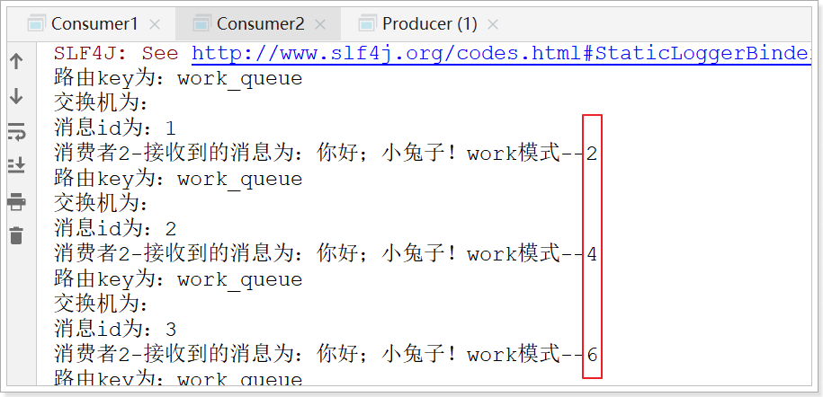

### 4.1.4. 小结

在一个队列中如果有多个消费者，那么消费者之间对于同一个消息的关系是**竞争**的关系。


## 4.2. 订阅模式类型

订阅模式示例图：


前面2个案例中，只有3个角色：

- P：生产者，也就是要发送消息的程序
- C：消费者：消息的接受者，会一直等待消息到来。
- queue：消息队列，图中红色部分


而在订阅模型中，多了一个exchange角色，而且过程略有变化：

- P：生产者，也就是要发送消息的程序，但是不再发送到队列中，而是发给X（交换机）
- C：消费者，消息的接受者，会一直等待消息到来。
- Queue：消息队列，接收消息、缓存消息。
- Exchange：交换机，图中的X。一方面，接收生产者发送的消息。另一方面，知道如何处理消息，例如递交给某个特别队列、递交给所有队列、或是将消息丢弃。到底如何操作，取决于Exchange的类型。Exchange有常见以下3种类型：
  - Fanout：广播，将消息交给所有绑定到交换机的队列
  - Direct：定向，把消息交给符合指定routing key 的队列
  - Topic：通配符，把消息交给符合routing pattern（路由模式） 的队列

**Exchange（交换机）只负责转发消息，不具备存储消息的能力**，因此如果没有任何队列与Exchange绑定，或者没有符合路由规则的队列，那么消息会丢失！


消费者同时接受 消息


## 4.3. Publish/Subscribe发布与订阅模式

### 4.3.1. 模式说明


发布订阅模式：
1、每个消费者监听自己的队列。
2、生产者将消息发给broker，由交换机将消息转发到绑定此交换机的每个队列，每个绑定交换机的队列都将接收
到消息


### 4.3.2. 代码

#### 1）生产者

```java
package com.itheima.rabbitmq.ps;

import com.itheima.rabbitmq.util.ConnectionUtil;
import com.rabbitmq.client.BuiltinExchangeType;
import com.rabbitmq.client.Channel;
import com.rabbitmq.client.Connection;

/**
 * 发布与订阅使用的交换机类型为：fanout
 */
public class Producer {

    //交换机名称
    static final String FANOUT_EXCHAGE = "fanout_exchange";
    //队列名称
    static final String FANOUT_QUEUE_1 = "fanout_queue_1";
    //队列名称
    static final String FANOUT_QUEUE_2 = "fanout_queue_2";

    public static void main(String[] args) throws Exception {

        //创建连接
        Connection connection = ConnectionUtil.getConnection();

        // 创建频道
        Channel channel = connection.createChannel();

        /**
         * 声明交换机
         * 参数1：交换机名称
         * 参数2：交换机类型，fanout、topic、direct、headers
         */
        channel.exchangeDeclare(FANOUT_EXCHAGE, BuiltinExchangeType.FANOUT);

        // 声明（创建）队列
        /**
         * 参数1：队列名称
         * 参数2：是否定义持久化队列
         * 参数3：是否独占本次连接
         * 参数4：是否在不使用的时候自动删除队列
         * 参数5：队列其它参数
         */
        channel.queueDeclare(FANOUT_QUEUE_1, true, false, false, null);
        channel.queueDeclare(FANOUT_QUEUE_2, true, false, false, null);

        //队列绑定交换机
        channel.queueBind(FANOUT_QUEUE_1, FANOUT_EXCHAGE, "");
        channel.queueBind(FANOUT_QUEUE_2, FANOUT_EXCHAGE, "");

        for (int i = 1; i <= 10; i++) {
            // 发送信息
            String message = "你好；小兔子！发布订阅模式--" + i;
            /**
             * 参数1：交换机名称，如果没有指定则使用默认Default Exchage
             * 参数2：路由key,简单模式可以传递队列名称
             * 参数3：消息其它属性
             * 参数4：消息内容
             */
            channel.basicPublish(FANOUT_EXCHAGE, "", null, message.getBytes());
            System.out.println("已发送消息：" + message);
        }

        // 关闭资源
        channel.close();
        connection.close();
    }
}
```


#### 2）消费者1

```java
package com.itheima.rabbitmq.ps;

import com.itheima.rabbitmq.util.ConnectionUtil;
import com.rabbitmq.client.*;

import java.io.IOException;

public class Consumer1 {

    public static void main(String[] args) throws Exception {
        Connection connection = ConnectionUtil.getConnection();

        // 创建频道
        Channel channel = connection.createChannel();

        //声明交换机
        channel.exchangeDeclare(Producer.FANOUT_EXCHAGE, BuiltinExchangeType.FANOUT);

        // 声明（创建）队列
        /**
         * 参数1：队列名称
         * 参数2：是否定义持久化队列
         * 参数3：是否独占本次连接
         * 参数4：是否在不使用的时候自动删除队列
         * 参数5：队列其它参数
         */
        channel.queueDeclare(Producer.FANOUT_QUEUE_1, true, false, false, null);

        //队列绑定交换机
        channel.queueBind(Producer.FANOUT_QUEUE_1, Producer.FANOUT_EXCHAGE, "");

        //创建消费者；并设置消息处理
        DefaultConsumer consumer = new DefaultConsumer(channel){
            @Override
            /**
             * consumerTag 消息者标签，在channel.basicConsume时候可以指定
             * envelope 消息包的内容，可从中获取消息id，消息routingkey，交换机，消息和重传标志(收到消息失败后是否需要重新发送)
             * properties 属性信息
             * body 消息
             */
            public void handleDelivery(String consumerTag, Envelope envelope, AMQP.BasicProperties properties, byte[] body) throws IOException {
                //路由key
                System.out.println("路由key为：" + envelope.getRoutingKey());
                //交换机
                System.out.println("交换机为：" + envelope.getExchange());
                //消息id
                System.out.println("消息id为：" + envelope.getDeliveryTag());
                //收到的消息
                System.out.println("消费者1-接收到的消息为：" + new String(body, "utf-8"));
            }
        };
        //监听消息
        /**
         * 参数1：队列名称
         * 参数2：是否自动确认，设置为true为表示消息接收到自动向mq回复接收到了，mq接收到回复会删除消息，设置为false则需要手动确认
         * 参数3：消息接收到后回调
         */
        channel.basicConsume(Producer.FANOUT_QUEUE_1, true, consumer);
    }
}

```

#### 3）消费者2

```java
package com.itheima.rabbitmq.ps;

import com.itheima.rabbitmq.util.ConnectionUtil;
import com.rabbitmq.client.*;

import java.io.IOException;

public class Consumer2 {

    public static void main(String[] args) throws Exception {
        Connection connection = ConnectionUtil.getConnection();

        // 创建频道
        Channel channel = connection.createChannel();

        //声明交换机
        channel.exchangeDeclare(Producer.FANOUT_EXCHAGE, BuiltinExchangeType.FANOUT);

        // 声明（创建）队列
        /**
         * 参数1：队列名称
         * 参数2：是否定义持久化队列
         * 参数3：是否独占本次连接
         * 参数4：是否在不使用的时候自动删除队列
         * 参数5：队列其它参数
         */
        channel.queueDeclare(Producer.FANOUT_QUEUE_2, true, false, false, null);

        //队列绑定交换机
        channel.queueBind(Producer.FANOUT_QUEUE_2, Producer.FANOUT_EXCHAGE, "");

        //创建消费者；并设置消息处理
        DefaultConsumer consumer = new DefaultConsumer(channel){
            @Override
            /**
             * consumerTag 消息者标签，在channel.basicConsume时候可以指定
             * envelope 消息包的内容，可从中获取消息id，消息routingkey，交换机，消息和重传标志(收到消息失败后是否需要重新发送)
             * properties 属性信息
             * body 消息
             */
            public void handleDelivery(String consumerTag, Envelope envelope, AMQP.BasicProperties properties, byte[] body) throws IOException {
                //路由key
                System.out.println("路由key为：" + envelope.getRoutingKey());
                //交换机
                System.out.println("交换机为：" + envelope.getExchange());
                //消息id
                System.out.println("消息id为：" + envelope.getDeliveryTag());
                //收到的消息
                System.out.println("消费者2-接收到的消息为：" + new String(body, "utf-8"));
            }
        };
        //监听消息
        /**
         * 参数1：队列名称
         * 参数2：是否自动确认，设置为true为表示消息接收到自动向mq回复接收到了，mq接收到回复会删除消息，设置为false则需要手动确认
         * 参数3：消息接收到后回调
         */
        channel.basicConsume(Producer.FANOUT_QUEUE_2, true, consumer);
    }
}
```


### 4.3.3. 测试

启动所有消费者，然后使用生产者发送消息；在每个消费者对应的控制台可以查看到生产者发送的所有消息；到达**广播**的效果。

在执行完测试代码后，其实到RabbitMQ的管理后台找到`Exchanges`选项卡，点击 `fanout_exchange` 的交换机，可以查看到如下的绑定：


### 4.3.4. 小结

交换机需要与队列进行绑定，绑定之后；一个消息可以被多个消费者都收到。


**发布订阅模式与工作队列模式的区别**

1、工作队列模式不用定义交换机，而发布/订阅模式需要定义交换机。 

2、发布/订阅模式的生产方是面向交换机发送消息，工作队列模式的生产方是面向队列发送消息(底层使用默认交换机)。

3、发布/订阅模式需要设置队列和交换机的绑定，工作队列模式不需要设置，实际上工作队列模式会将队列绑 定到默认的交换机 。

## 4.4. Routing路由模式

### 4.4.1. 模式说明

路由模式特点：

- 队列与交换机的绑定，不能是任意绑定了，而是要指定一个`RoutingKey`（路由key）
- 消息的发送方在 向 Exchange发送消息时，也必须指定消息的 `RoutingKey`。
- Exchange不再把消息交给每一个绑定的队列，而是根据消息的`Routing Key`进行判断，只有队列的`Routingkey`与消息的 `Routing key`完全一致，才会接收到消息


图解：

- P：生产者，向Exchange发送消息，发送消息时，会指定一个routing key。
- X：Exchange（交换机），接收生产者的消息，然后把消息递交给 与routing key完全匹配的队列
- C1：消费者，其所在队列指定了需要routing key 为 error 的消息
- C2：消费者，其所在队列指定了需要routing key 为 info、error、warning 的消息


### 4.4.2. 代码

在编码上与 `Publish/Subscribe发布与订阅模式` 的区别是交换机的类型为：Direct，还有队列绑定交换机的时候需要指定routing key。

#### 1）生产者

```java
package com.itheima.rabbitmq.routing;

import com.itheima.rabbitmq.util.ConnectionUtil;
import com.rabbitmq.client.BuiltinExchangeType;
import com.rabbitmq.client.Channel;
import com.rabbitmq.client.Connection;

/**
 * 路由模式的交换机类型为：direct
 */
public class Producer {

    //交换机名称
    static final String DIRECT_EXCHAGE = "direct_exchange";
    //队列名称
    static final String DIRECT_QUEUE_INSERT = "direct_queue_insert";
    //队列名称
    static final String DIRECT_QUEUE_UPDATE = "direct_queue_update";

    public static void main(String[] args) throws Exception {

        //创建连接
        Connection connection = ConnectionUtil.getConnection();

        // 创建频道
        Channel channel = connection.createChannel();

        /**
         * 声明交换机
         * 参数1：交换机名称
         * 参数2：交换机类型，fanout、topic、direct、headers
         */
        channel.exchangeDeclare(DIRECT_EXCHAGE, BuiltinExchangeType.DIRECT);

        // 声明（创建）队列
        /**
         * 参数1：队列名称
         * 参数2：是否定义持久化队列
         * 参数3：是否独占本次连接
         * 参数4：是否在不使用的时候自动删除队列
         * 参数5：队列其它参数
         */
        channel.queueDeclare(DIRECT_QUEUE_INSERT, true, false, false, null);
        channel.queueDeclare(DIRECT_QUEUE_UPDATE, true, false, false, null);

        //队列绑定交换机
        channel.queueBind(DIRECT_QUEUE_INSERT, DIRECT_EXCHAGE, "insert");
        channel.queueBind(DIRECT_QUEUE_UPDATE, DIRECT_EXCHAGE, "update");

        // 发送信息
        String message = "新增了商品。路由模式；routing key 为 insert " ;
        /**
         * 参数1：交换机名称，如果没有指定则使用默认Default Exchage
         * 参数2：路由key,简单模式可以传递队列名称
         * 参数3：消息其它属性
         * 参数4：消息内容
         */
        channel.basicPublish(DIRECT_EXCHAGE, "insert", null, message.getBytes());
        System.out.println("已发送消息：" + message);

        // 发送信息
        message = "修改了商品。路由模式；routing key 为 update" ;
        /**
         * 参数1：交换机名称，如果没有指定则使用默认Default Exchage
         * 参数2：路由key,简单模式可以传递队列名称
         * 参数3：消息其它属性
         * 参数4：消息内容
         */
        channel.basicPublish(DIRECT_EXCHAGE, "update", null, message.getBytes());
        System.out.println("已发送消息：" + message);

        // 关闭资源
        channel.close();
        connection.close();
    }
}

```
#### 2）消费者1

```java
package com.itheima.rabbitmq.routing;

import com.itheima.rabbitmq.util.ConnectionUtil;
import com.rabbitmq.client.*;

import java.io.IOException;

public class Consumer1 {

    public static void main(String[] args) throws Exception {
        Connection connection = ConnectionUtil.getConnection();

        // 创建频道
        Channel channel = connection.createChannel();

        //声明交换机
        channel.exchangeDeclare(Producer.DIRECT_EXCHAGE, BuiltinExchangeType.DIRECT);

        // 声明（创建）队列
        /**
         * 参数1：队列名称
         * 参数2：是否定义持久化队列
         * 参数3：是否独占本次连接
         * 参数4：是否在不使用的时候自动删除队列
         * 参数5：队列其它参数
         */
        channel.queueDeclare(Producer.DIRECT_QUEUE_INSERT, true, false, false, null);

        //队列绑定交换机
        channel.queueBind(Producer.DIRECT_QUEUE_INSERT, Producer.DIRECT_EXCHAGE, "insert");

        //创建消费者；并设置消息处理
        DefaultConsumer consumer = new DefaultConsumer(channel){
            @Override
            /**
             * consumerTag 消息者标签，在channel.basicConsume时候可以指定
             * envelope 消息包的内容，可从中获取消息id，消息routingkey，交换机，消息和重传标志(收到消息失败后是否需要重新发送)
             * properties 属性信息
             * body 消息
             */
            public void handleDelivery(String consumerTag, Envelope envelope, AMQP.BasicProperties properties, byte[] body) throws IOException {
                //路由key
                System.out.println("路由key为：" + envelope.getRoutingKey());
                //交换机
                System.out.println("交换机为：" + envelope.getExchange());
                //消息id
                System.out.println("消息id为：" + envelope.getDeliveryTag());
                //收到的消息
                System.out.println("消费者1-接收到的消息为：" + new String(body, "utf-8"));
            }
        };
        //监听消息
        /**
         * 参数1：队列名称
         * 参数2：是否自动确认，设置为true为表示消息接收到自动向mq回复接收到了，mq接收到回复会删除消息，设置为false则需要手动确认
         * 参数3：消息接收到后回调
         */
        channel.basicConsume(Producer.DIRECT_QUEUE_INSERT, true, consumer);
    }
}

```
#### 3）消费者2

```java
package com.itheima.rabbitmq.routing;

import com.itheima.rabbitmq.util.ConnectionUtil;
import com.rabbitmq.client.*;

import java.io.IOException;

public class Consumer2 {

    public static void main(String[] args) throws Exception {
        Connection connection = ConnectionUtil.getConnection();

        // 创建频道
        Channel channel = connection.createChannel();

        //声明交换机
        channel.exchangeDeclare(Producer.DIRECT_EXCHAGE, BuiltinExchangeType.DIRECT);

        // 声明（创建）队列
        /**
         * 参数1：队列名称
         * 参数2：是否定义持久化队列
         * 参数3：是否独占本次连接
         * 参数4：是否在不使用的时候自动删除队列
         * 参数5：队列其它参数
         */
        channel.queueDeclare(Producer.DIRECT_QUEUE_UPDATE, true, false, false, null);

        //队列绑定交换机
        channel.queueBind(Producer.DIRECT_QUEUE_UPDATE, Producer.DIRECT_EXCHAGE, "update");

        //创建消费者；并设置消息处理
        DefaultConsumer consumer = new DefaultConsumer(channel){
            @Override
            /**
             * consumerTag 消息者标签，在channel.basicConsume时候可以指定
             * envelope 消息包的内容，可从中获取消息id，消息routingkey，交换机，消息和重传标志(收到消息失败后是否需要重新发送)
             * properties 属性信息
             * body 消息
             */
            public void handleDelivery(String consumerTag, Envelope envelope, AMQP.BasicProperties properties, byte[] body) throws IOException {
                //路由key
                System.out.println("路由key为：" + envelope.getRoutingKey());
                //交换机
                System.out.println("交换机为：" + envelope.getExchange());
                //消息id
                System.out.println("消息id为：" + envelope.getDeliveryTag());
                //收到的消息
                System.out.println("消费者2-接收到的消息为：" + new String(body, "utf-8"));
            }
        };
        //监听消息
        /**
         * 参数1：队列名称
         * 参数2：是否自动确认，设置为true为表示消息接收到自动向mq回复接收到了，mq接收到回复会删除消息，设置为false则需要手动确认
         * 参数3：消息接收到后回调
         */
        channel.basicConsume(Producer.DIRECT_QUEUE_UPDATE, true, consumer);
    }
}

```


### 4.4.3. 测试

启动所有消费者，然后使用生产者发送消息；在消费者对应的控制台可以查看到生产者发送对应routing key对应队列的消息；到达**按照需要接收**的效果。

在执行完测试代码后，其实到RabbitMQ的管理后台找到`Exchanges`选项卡，点击 `direct_exchange` 的交换机，可以查看到如下的绑定：


### 4.4.4. 小结

Routing模式要求队列在绑定交换机时要指定routing key，消息会转发到符合routing key的队列。


## 4.5. Topics通配符模式

### 4.5.1. 模式说明

`Topic`类型与`Direct`相比，都是可以根据`RoutingKey`把消息路由到不同的队列。只不过`Topic`类型`Exchange`可以让队列在绑定`Routing key` 的时候**使用通配符**！


`Routingkey` 一般都是有一个或多个单词组成，多个单词之间以”.”分割，例如： `item.insert`

 通配符规则：

`#`：匹配一个或多个词

`*`：匹配不多不少恰好1个词

举例：

`item.#`：能够匹配`item.insert.abc` 或者 `item.insert`

`item.*`：只能匹配`item.insert`


图解：

- 红色Queue：绑定的是`usa.#` ，因此凡是以 `usa.`开头的`routing key` 都会被匹配到
- 黄色Queue：绑定的是`#.news` ，因此凡是以 `.news`结尾的 `routing key` 都会被匹配


### 4.5.2. 代码

#### 1）生产者

使用topic类型的Exchange，发送消息的routing key有3种： `item.insert`、`item.update`、`item.delete`：

```java
package com.itheima.rabbitmq.topic;

import com.itheima.rabbitmq.util.ConnectionUtil;
import com.rabbitmq.client.BuiltinExchangeType;
import com.rabbitmq.client.Channel;
import com.rabbitmq.client.Connection;

/**
 * 通配符Topic的交换机类型为：topic
 */
public class Producer {

    //交换机名称
    static final String TOPIC_EXCHAGE = "topic_exchange";
    //队列名称
    static final String TOPIC_QUEUE_1 = "topic_queue_1";
    //队列名称
    static final String TOPIC_QUEUE_2 = "topic_queue_2";

    public static void main(String[] args) throws Exception {

        //创建连接
        Connection connection = ConnectionUtil.getConnection();

        // 创建频道
        Channel channel = connection.createChannel();

        /**
         * 声明交换机
         * 参数1：交换机名称
         * 参数2：交换机类型，fanout、topic、topic、headers
         */
        channel.exchangeDeclare(TOPIC_EXCHAGE, BuiltinExchangeType.TOPIC);


        // 发送信息
        String message = "新增了商品。Topic模式；routing key 为 item.insert " ;
        channel.basicPublish(TOPIC_EXCHAGE, "item.insert", null, message.getBytes());
        System.out.println("已发送消息：" + message);

        // 发送信息
        message = "修改了商品。Topic模式；routing key 为 item.update" ;
        channel.basicPublish(TOPIC_EXCHAGE, "item.update", null, message.getBytes());
        System.out.println("已发送消息：" + message);

        // 发送信息
        message = "删除了商品。Topic模式；routing key 为 item.delete" ;
        channel.basicPublish(TOPIC_EXCHAGE, "item.delete", null, message.getBytes());
        System.out.println("已发送消息：" + message);

        // 关闭资源
        channel.close();
        connection.close();
    }
}

```
#### 2）消费者1

接收两种类型的消息：更新商品和删除商品

```java
package com.itheima.rabbitmq.topic;

import com.itheima.rabbitmq.util.ConnectionUtil;
import com.rabbitmq.client.*;

import java.io.IOException;

public class Consumer1 {

    public static void main(String[] args) throws Exception {
        Connection connection = ConnectionUtil.getConnection();

        // 创建频道
        Channel channel = connection.createChannel();

        //声明交换机
        channel.exchangeDeclare(Producer.TOPIC_EXCHAGE, BuiltinExchangeType.TOPIC);

        // 声明（创建）队列
        /**
         * 参数1：队列名称
         * 参数2：是否定义持久化队列
         * 参数3：是否独占本次连接
         * 参数4：是否在不使用的时候自动删除队列
         * 参数5：队列其它参数
         */
        channel.queueDeclare(Producer.TOPIC_QUEUE_1, true, false, false, null);

        //队列绑定交换机
        channel.queueBind(Producer.TOPIC_QUEUE_1, Producer.TOPIC_EXCHAGE, "item.update");
        channel.queueBind(Producer.TOPIC_QUEUE_1, Producer.TOPIC_EXCHAGE, "item.delete");

        //创建消费者；并设置消息处理
        DefaultConsumer consumer = new DefaultConsumer(channel){
            @Override
            /**
             * consumerTag 消息者标签，在channel.basicConsume时候可以指定
             * envelope 消息包的内容，可从中获取消息id，消息routingkey，交换机，消息和重传标志(收到消息失败后是否需要重新发送)
             * properties 属性信息
             * body 消息
             */
            public void handleDelivery(String consumerTag, Envelope envelope, AMQP.BasicProperties properties, byte[] body) throws IOException {
                //路由key
                System.out.println("路由key为：" + envelope.getRoutingKey());
                //交换机
                System.out.println("交换机为：" + envelope.getExchange());
                //消息id
                System.out.println("消息id为：" + envelope.getDeliveryTag());
                //收到的消息
                System.out.println("消费者1-接收到的消息为：" + new String(body, "utf-8"));
            }
        };
        //监听消息
        /**
         * 参数1：队列名称
         * 参数2：是否自动确认，设置为true为表示消息接收到自动向mq回复接收到了，mq接收到回复会删除消息，设置为false则需要手动确认
         * 参数3：消息接收到后回调
         */
        channel.basicConsume(Producer.TOPIC_QUEUE_1, true, consumer);
    }
}

```
#### 3）消费者2

接收所有类型的消息：新增商品，更新商品和删除商品。

```java
package com.itheima.rabbitmq.topic;

import com.itheima.rabbitmq.util.ConnectionUtil;
import com.rabbitmq.client.*;

import java.io.IOException;

public class Consumer2 {

    public static void main(String[] args) throws Exception {
        Connection connection = ConnectionUtil.getConnection();

        // 创建频道
        Channel channel = connection.createChannel();

        //声明交换机
        channel.exchangeDeclare(Producer.TOPIC_EXCHAGE, BuiltinExchangeType.TOPIC);

        // 声明（创建）队列
        /**
         * 参数1：队列名称
         * 参数2：是否定义持久化队列
         * 参数3：是否独占本次连接
         * 参数4：是否在不使用的时候自动删除队列
         * 参数5：队列其它参数
         */
        channel.queueDeclare(Producer.TOPIC_QUEUE_2, true, false, false, null);

        //队列绑定交换机
        channel.queueBind(Producer.TOPIC_QUEUE_2, Producer.TOPIC_EXCHAGE, "item.*");

        //创建消费者；并设置消息处理
        DefaultConsumer consumer = new DefaultConsumer(channel){
            @Override
            /**
             * consumerTag 消息者标签，在channel.basicConsume时候可以指定
             * envelope 消息包的内容，可从中获取消息id，消息routingkey，交换机，消息和重传标志(收到消息失败后是否需要重新发送)
             * properties 属性信息
             * body 消息
             */
            public void handleDelivery(String consumerTag, Envelope envelope, AMQP.BasicProperties properties, byte[] body) throws IOException {
                //路由key
                System.out.println("路由key为：" + envelope.getRoutingKey());
                //交换机
                System.out.println("交换机为：" + envelope.getExchange());
                //消息id
                System.out.println("消息id为：" + envelope.getDeliveryTag());
                //收到的消息
                System.out.println("消费者2-接收到的消息为：" + new String(body, "utf-8"));
            }
        };
        //监听消息
        /**
         * 参数1：队列名称
         * 参数2：是否自动确认，设置为true为表示消息接收到自动向mq回复接收到了，mq接收到回复会删除消息，设置为false则需要手动确认
         * 参数3：消息接收到后回调
         */
        channel.basicConsume(Producer.TOPIC_QUEUE_2, true, consumer);
    }
}

```

### 4.5.3. 测试

启动所有消费者，然后使用生产者发送消息；在消费者对应的控制台可以查看到生产者发送对应routing key对应队列的消息；到达**按照需要接收**的效果；并且这些routing key可以使用通配符。

在执行完测试代码后，其实到RabbitMQ的管理后台找到`Exchanges`选项卡，点击 `topic_exchange` 的交换机，可以查看到如下的绑定：


### 4.5.4. 小结

Topic主题模式可以实现 `Publish/Subscribe发布与订阅模式` 和 ` Routing路由模式` 的功能；只是Topic在配置routing key 的时候可以使用通配符，显得更加灵活。

## 4.6. 模式总结

RabbitMQ工作模式：
**1、简单模式 HelloWorld**
一个生产者、一个消费者，不需要设置交换机（使用默认的交换机）

**2、工作队列模式 Work Queue**
一个生产者、多个消费者（竞争关系），不需要设置交换机（使用默认的交换机）

**3、发布订阅模式 Publish/subscribe**
需要设置类型为fanout的交换机，并且交换机和队列进行绑定，当发送消息到交换机后，交换机会将消息发送到绑定的队列

**4、路由模式 Routing**
需要设置类型为direct的交换机，交换机和队列进行绑定，并且指定routing key，当发送消息到交换机后，交换机会根据routing key将消息发送到对应的队列

**5、通配符模式 Topic**
需要设置类型为topic的交换机，交换机和队列进行绑定，并且指定通配符方式的routing key，当发送消息到交换机后，交换机会根据routing key将消息发送到对应的队列


# 5. Spring 整合RabbitMQ

## 5.1. 搭建生产者工程

### 5.1.1. 创建工程


### 5.1.2. 添加依赖

修改pom.xml文件内容为如下：

```xml
<?xml version="1.0" encoding="UTF-8"?>
<project xmlns="http://maven.apache.org/POM/4.0.0"
         xmlns:xsi="http://www.w3.org/2001/XMLSchema-instance"
         xsi:schemaLocation="http://maven.apache.org/POM/4.0.0 http://maven.apache.org/xsd/maven-4.0.0.xsd">
    <modelVersion>4.0.0</modelVersion>

    <groupId>com.itheima</groupId>
    <artifactId>spring-rabbitmq-producer</artifactId>
    <version>1.0-SNAPSHOT</version>

    <dependencies>
        <dependency>
            <groupId>org.springframework</groupId>
            <artifactId>spring-context</artifactId>
            <version>5.1.7.RELEASE</version>
        </dependency>

        <dependency>
            <groupId>org.springframework.amqp</groupId>
            <artifactId>spring-rabbit</artifactId>
            <version>2.1.8.RELEASE</version>
        </dependency>

        <dependency>
            <groupId>junit</groupId>
            <artifactId>junit</artifactId>
            <version>4.12</version>
        </dependency>

        <dependency>
            <groupId>org.springframework</groupId>
            <artifactId>spring-test</artifactId>
            <version>5.1.7.RELEASE</version>
        </dependency>
    </dependencies>

</project>
```


### 5.1.3. 配置整合

1. 创建`spring-rabbitmq-producer\src\main\resources\properties\rabbitmq.properties`连接参数等配置文件；

```properties
rabbitmq.host=192.168.12.135
rabbitmq.port=5672
rabbitmq.username=heima
rabbitmq.password=heima
rabbitmq.virtual-host=/itcast
```


2. 创建 `spring-rabbitmq-producer\src\main\resources\spring\spring-rabbitmq.xml` 整合配置文件；

```xml
<?xml version="1.0" encoding="UTF-8"?>
<beans xmlns="http://www.springframework.org/schema/beans"
       xmlns:xsi="http://www.w3.org/2001/XMLSchema-instance"
       xmlns:context="http://www.springframework.org/schema/context"
       xmlns:rabbit="http://www.springframework.org/schema/rabbit"
       xsi:schemaLocation="http://www.springframework.org/schema/beans
       http://www.springframework.org/schema/beans/spring-beans.xsd
       http://www.springframework.org/schema/context
       https://www.springframework.org/schema/context/spring-context.xsd
       http://www.springframework.org/schema/rabbit
       http://www.springframework.org/schema/rabbit/spring-rabbit.xsd">
    <!--加载配置文件-->
    <context:property-placeholder location="classpath:properties/rabbitmq.properties"/>

    <!-- 定义rabbitmq connectionFactory -->
    <rabbit:connection-factory id="connectionFactory" host="${rabbitmq.host}"
                               port="${rabbitmq.port}"
                               username="${rabbitmq.username}"
                               password="${rabbitmq.password}"
                               virtual-host="${rabbitmq.virtual-host}"/>
    <!--定义管理交换机、队列-->
    <rabbit:admin connection-factory="connectionFactory"/>

    <!--定义持久化队列，不存在则自动创建；不绑定到交换机则绑定到默认交换机
    默认交换机类型为direct，名字为：""，路由键为队列的名称
    -->
    <rabbit:queue id="spring_queue" name="spring_queue" auto-declare="true"/>

    <!-- ~~~~~~~~~~~~~~~~~~~~~~~~~~~~广播；所有队列都能收到消息~~~~~~~~~~~~~~~~~~~~~~~~~~~~ -->
    <!--定义广播交换机中的持久化队列，不存在则自动创建-->
    <rabbit:queue id="spring_fanout_queue_1" name="spring_fanout_queue_1" auto-declare="true"/>

    <!--定义广播交换机中的持久化队列，不存在则自动创建-->
    <rabbit:queue id="spring_fanout_queue_2" name="spring_fanout_queue_2" auto-declare="true"/>

    <!--定义广播类型交换机；并绑定上述两个队列-->
    <rabbit:fanout-exchange id="spring_fanout_exchange" name="spring_fanout_exchange" auto-declare="true">
        <rabbit:bindings>
            <rabbit:binding queue="spring_fanout_queue_1"/>
            <rabbit:binding queue="spring_fanout_queue_2"/>
        </rabbit:bindings>
    </rabbit:fanout-exchange>

    <!-- ~~~~~~~~~~~~~~~~~~~~~~~~~~~~通配符；*匹配一个单词，#匹配多个单词 ~~~~~~~~~~~~~~~~~~~~~~~~~~~~ -->
    <!--定义广播交换机中的持久化队列，不存在则自动创建-->
    <rabbit:queue id="spring_topic_queue_star" name="spring_topic_queue_star" auto-declare="true"/>
    <!--定义广播交换机中的持久化队列，不存在则自动创建-->
    <rabbit:queue id="spring_topic_queue_well" name="spring_topic_queue_well" auto-declare="true"/>
    <!--定义广播交换机中的持久化队列，不存在则自动创建-->
    <rabbit:queue id="spring_topic_queue_well2" name="spring_topic_queue_well2" auto-declare="true"/>

    <rabbit:topic-exchange id="spring_topic_exchange" name="spring_topic_exchange" auto-declare="true">
        <rabbit:bindings>
            <rabbit:binding pattern="heima.*" queue="spring_topic_queue_star"/>
            <rabbit:binding pattern="heima.#" queue="spring_topic_queue_well"/>
            <rabbit:binding pattern="itcast.#" queue="spring_topic_queue_well2"/>
        </rabbit:bindings>
    </rabbit:topic-exchange>

    <!--定义rabbitTemplate对象操作可以在代码中方便发送消息-->
    <rabbit:template id="rabbitTemplate" connection-factory="connectionFactory"/>
</beans>
```


### 5.1.4. 发送消息

创建测试文件 `spring-rabbitmq-producer\src\test\java\com\itheima\rabbitmq\ProducerTest.java`

```java
@RunWith(SpringJUnit4ClassRunner.class)
@ContextConfiguration(locations = "classpath:spring/spring-rabbitmq.xml")
public class ProducerTest {

    @Autowired
    private RabbitTemplate rabbitTemplate;

    /**
     * 只发队列消息
     * 默认交换机类型为 direct
     * 交换机的名称为空，路由键为队列的名称
     */
    @Test
    public void queueTest(){
        //路由键与队列同名
        rabbitTemplate.convertAndSend("spring_queue", "只发队列spring_queue的消息。");
    }

    /**
     * 发送广播
     * 交换机类型为 fanout
     * 绑定到该交换机的所有队列都能够收到消息
     */
    @Test
    public void fanoutTest(){
        /**
         * 参数1：交换机名称
         * 参数2：路由键名（广播设置为空）
         * 参数3：发送的消息内容
         */
        rabbitTemplate.convertAndSend("spring_fanout_exchange", "", "发送到spring_fanout_exchange交换机的广播消息");
    }

    /**
     * 通配符
     * 交换机类型为 topic
     * 匹配路由键的通配符，*表示一个单词，#表示多个单词
     * 绑定到该交换机的匹配队列能够收到对应消息
     */
    @Test
    public void topicTest(){
        /**
         * 参数1：交换机名称
         * 参数2：路由键名
         * 参数3：发送的消息内容
         */
        rabbitTemplate.convertAndSend("spring_topic_exchange", "heima.bj", "发送到spring_topic_exchange交换机heima.bj的消息");
        rabbitTemplate.convertAndSend("spring_topic_exchange", "heima.bj.1", "发送到spring_topic_exchange交换机heima.bj.1的消息");
        rabbitTemplate.convertAndSend("spring_topic_exchange", "heima.bj.2", "发送到spring_topic_exchange交换机heima.bj.2的消息");
        rabbitTemplate.convertAndSend("spring_topic_exchange", "itcast.cn", "发送到spring_topic_exchange交换机itcast.cn的消息");
    }
}

```


## 5.2. 搭建消费者工程

### 5.2.1. 创建工程


### 5.2.2. 添加依赖
修改pom.xml文件内容为如下：

```xml
<?xml version="1.0" encoding="UTF-8"?>
<project xmlns="http://maven.apache.org/POM/4.0.0"
         xmlns:xsi="http://www.w3.org/2001/XMLSchema-instance"
         xsi:schemaLocation="http://maven.apache.org/POM/4.0.0 http://maven.apache.org/xsd/maven-4.0.0.xsd">
    <modelVersion>4.0.0</modelVersion>

    <groupId>com.itheima</groupId>
    <artifactId>spring-rabbitmq-consumer</artifactId>
    <version>1.0-SNAPSHOT</version>
    <dependencies>
        <dependency>
            <groupId>org.springframework</groupId>
            <artifactId>spring-context</artifactId>
            <version>5.1.7.RELEASE</version>
        </dependency>

        <dependency>
            <groupId>org.springframework.amqp</groupId>
            <artifactId>spring-rabbit</artifactId>
            <version>2.1.8.RELEASE</version>
        </dependency>
    </dependencies>


</project>
```

### 5.2.3. 配置整合
1. 创建`spring-rabbitmq-consumer\src\main\resources\properties\rabbitmq.properties`连接参数等配置文件；

```properties
rabbitmq.host=192.168.12.135
rabbitmq.port=5672
rabbitmq.username=heima
rabbitmq.password=heima
rabbitmq.virtual-host=/itcast
```


2. 创建 `spring-rabbitmq-consumer\src\main\resources\spring\spring-rabbitmq.xml` 整合配置文件；

```xml
<?xml version="1.0" encoding="UTF-8"?>
<beans xmlns="http://www.springframework.org/schema/beans"
       xmlns:xsi="http://www.w3.org/2001/XMLSchema-instance"
       xmlns:context="http://www.springframework.org/schema/context"
       xmlns:rabbit="http://www.springframework.org/schema/rabbit"
       xsi:schemaLocation="http://www.springframework.org/schema/beans
       http://www.springframework.org/schema/beans/spring-beans.xsd
       http://www.springframework.org/schema/context
       https://www.springframework.org/schema/context/spring-context.xsd
       http://www.springframework.org/schema/rabbit
       http://www.springframework.org/schema/rabbit/spring-rabbit.xsd">
    <!--加载配置文件-->
    <context:property-placeholder location="classpath:properties/rabbitmq.properties"/>

    <!-- 定义rabbitmq connectionFactory -->
    <rabbit:connection-factory id="connectionFactory" host="${rabbitmq.host}"
                               port="${rabbitmq.port}"
                               username="${rabbitmq.username}"
                               password="${rabbitmq.password}"
                               virtual-host="${rabbitmq.virtual-host}"/>

    <bean id="springQueueListener" class="com.itheima.rabbitmq.listener.SpringQueueListener"/>
    <bean id="fanoutListener1" class="com.itheima.rabbitmq.listener.FanoutListener1"/>
    <bean id="fanoutListener2" class="com.itheima.rabbitmq.listener.FanoutListener2"/>
    <bean id="topicListenerStar" class="com.itheima.rabbitmq.listener.TopicListenerStar"/>
    <bean id="topicListenerWell" class="com.itheima.rabbitmq.listener.TopicListenerWell"/>
    <bean id="topicListenerWell2" class="com.itheima.rabbitmq.listener.TopicListenerWell2"/>

    <rabbit:listener-container connection-factory="connectionFactory" auto-declare="true">
        <rabbit:listener ref="springQueueListener" queue-names="spring_queue"/>
        <rabbit:listener ref="fanoutListener1" queue-names="spring_fanout_queue_1"/>
        <rabbit:listener ref="fanoutListener2" queue-names="spring_fanout_queue_2"/>
        <rabbit:listener ref="topicListenerStar" queue-names="spring_topic_queue_star"/>
        <rabbit:listener ref="topicListenerWell" queue-names="spring_topic_queue_well"/>
        <rabbit:listener ref="topicListenerWell2" queue-names="spring_topic_queue_well2"/>
    </rabbit:listener-container>
</beans>
```

### 5.2.4. 消息监听器

#### 1）队列监听器

创建 `spring-rabbitmq-consumer\src\main\java\com\itheima\rabbitmq\listener\SpringQueueListener.java`

```java
public class SpringQueueListener implements MessageListener {
    public void onMessage(Message message) {
        try {
            String msg = new String(message.getBody(), "utf-8");

            System.out.printf("接收路由名称为：%s，路由键为：%s，队列名为：%s的消息：%s \n",
                    message.getMessageProperties().getReceivedExchange(),
                    message.getMessageProperties().getReceivedRoutingKey(),
                    message.getMessageProperties().getConsumerQueue(),
                    msg);
        } catch (Exception e) {
            e.printStackTrace();
        }
    }
}
```


#### 2）广播监听器1
创建 `spring-rabbitmq-consumer\src\main\java\com\itheima\rabbitmq\listener\FanoutListener1.java`

```java
public class FanoutListener1 implements MessageListener {
    public void onMessage(Message message) {
        try {
            String msg = new String(message.getBody(), "utf-8");

            System.out.printf("广播监听器1：接收路由名称为：%s，路由键为：%s，队列名为：%s的消息：%s \n",
                    message.getMessageProperties().getReceivedExchange(),
                    message.getMessageProperties().getReceivedRoutingKey(),
                    message.getMessageProperties().getConsumerQueue(),
                    msg);
        } catch (Exception e) {
            e.printStackTrace();
        }
    }
}

```

#### 3）广播监听器2
创建 `spring-rabbitmq-consumer\src\main\java\com\itheima\rabbitmq\listener\FanoutListener2.java`

```java
public class FanoutListener2 implements MessageListener {
    public void onMessage(Message message) {
        try {
            String msg = new String(message.getBody(), "utf-8");

            System.out.printf("广播监听器2：接收路由名称为：%s，路由键为：%s，队列名为：%s的消息：%s \n",
                    message.getMessageProperties().getReceivedExchange(),
                    message.getMessageProperties().getReceivedRoutingKey(),
                    message.getMessageProperties().getConsumerQueue(),
                    msg);
        } catch (Exception e) {
            e.printStackTrace();
        }
    }
}
```

#### 4）星号通配符监听器
创建 `spring-rabbitmq-consumer\src\main\java\com\itheima\rabbitmq\listener\TopicListenerStar.java`

```java
public class TopicListenerStar implements MessageListener {
    public void onMessage(Message message) {
        try {
            String msg = new String(message.getBody(), "utf-8");

            System.out.printf("通配符*监听器：接收路由名称为：%s，路由键为：%s，队列名为：%s的消息：%s \n",
                    message.getMessageProperties().getReceivedExchange(),
                    message.getMessageProperties().getReceivedRoutingKey(),
                    message.getMessageProperties().getConsumerQueue(),
                    msg);
        } catch (Exception e) {
            e.printStackTrace();
        }
    }
}

```

#### 5）井号通配符监听器
创建 `spring-rabbitmq-consumer\src\main\java\com\itheima\rabbitmq\listener\TopicListenerWell.java`

```java
public class TopicListenerWell implements MessageListener {
    public void onMessage(Message message) {
        try {
            String msg = new String(message.getBody(), "utf-8");

            System.out.printf("通配符#监听器：接收路由名称为：%s，路由键为：%s，队列名为：%s的消息：%s \n",
                    message.getMessageProperties().getReceivedExchange(),
                    message.getMessageProperties().getReceivedRoutingKey(),
                    message.getMessageProperties().getConsumerQueue(),
                    msg);
        } catch (Exception e) {
            e.printStackTrace();
        }
    }
}

```

#### 6）井号通配符监听器2
创建 `spring-rabbitmq-consumer\src\main\java\com\itheima\rabbitmq\listener\TopicListenerWell2.java`

```java
public class TopicListenerWell2 implements MessageListener {
    public void onMessage(Message message) {
        try {
            String msg = new String(message.getBody(), "utf-8");

            System.out.printf("通配符#监听器2：接收路由名称为：%s，路由键为：%s，队列名为：%s的消息：%s \n",
                    message.getMessageProperties().getReceivedExchange(),
                    message.getMessageProperties().getReceivedRoutingKey(),
                    message.getMessageProperties().getConsumerQueue(),
                    msg);
        } catch (Exception e) {
            e.printStackTrace();
        }
    }
}

```


# 6. Spring Boot整合RabbitMQ


## 6.1. 简介

在Spring项目中，可以使用Spring-Rabbit去操作RabbitMQ
https://github.com/spring-projects/spring-amqp

尤其是在spring boot项目中只需要引入对应的amqp启动器依赖即可，方便的使用RabbitTemplate发送消息，使用注解接收消息。


*一般在开发过程中*：

**生产者工程：**

1. application.yml文件配置RabbitMQ相关信息；
2. 在生产者工程中编写配置类，用于创建交换机和队列，并进行绑定

3. 注入RabbitTemplate对象，通过RabbitTemplate对象发送消息到交换机


**消费者工程：**

1. application.yml文件配置RabbitMQ相关信息

2. 创建消息处理类，用于接收队列中的消息并进行处理


## 5.2. 搭建生产者工程

### 5.2.1. 创建工程

创建生产者工程springboot-rabbitmq-producer


### 5.2.2. 添加依赖

修改pom.xml文件内容为如下：

```xml
<?xml version="1.0" encoding="UTF-8"?>
<project xmlns="http://maven.apache.org/POM/4.0.0"
         xmlns:xsi="http://www.w3.org/2001/XMLSchema-instance"
         xsi:schemaLocation="http://maven.apache.org/POM/4.0.0 http://maven.apache.org/xsd/maven-4.0.0.xsd">
    <modelVersion>4.0.0</modelVersion>
    <parent>
        <groupId>org.springframework.boot</groupId>
        <artifactId>spring-boot-starter-parent</artifactId>
        <version>2.1.4.RELEASE</version>
    </parent>
    <groupId>com.itheima</groupId>
    <artifactId>springboot-rabbitmq-producer</artifactId>
    <version>1.0-SNAPSHOT</version>

    <dependencies>
        <dependency>
            <groupId>org.springframework.boot</groupId>
            <artifactId>spring-boot-starter-amqp</artifactId>
        </dependency>
        <dependency>
            <groupId>org.springframework.boot</groupId>
            <artifactId>spring-boot-starter-test</artifactId>
        </dependency>
    </dependencies>
</project>
```


### 5.2.3. 启动类

```java
package com.itheima.rabbitmq;

import org.springframework.boot.SpringApplication;
import org.springframework.boot.autoconfigure.SpringBootApplication;

@SpringBootApplication
public class ProducerApplication {
    public static void main(String[] args) {
        SpringApplication.run(ProducerApplication.class);
    }
}

```


### 5.2.4. 配置RabbitMQ

#### 1）配置文件

创建application.yml，内容如下：

```yml
spring:
  rabbitmq:
    host: localhost
    port: 5672
    virtual-host: /itcast
    username: heima
    password: heima
```


#### 2）绑定交换机和队列

创建RabbitMQ队列与交换机绑定的配置类com.itheima.rabbitmq.config.RabbitMQConfig

```java
package com.itheima.rabbitmq.config;

import org.springframework.amqp.core.*;
import org.springframework.beans.factory.annotation.Qualifier;
import org.springframework.context.annotation.Bean;
import org.springframework.context.annotation.Configuration;

@Configuration
public class RabbitMQConfig {
    //交换机名称
    public static final String ITEM_TOPIC_EXCHANGE = "item_topic_exchange";
    //队列名称
    public static final String ITEM_QUEUE = "item_queue";

    //声明交换机
    @Bean("itemTopicExchange")
    public Exchange topicExchange(){
        return ExchangeBuilder.topicExchange(ITEM_TOPIC_EXCHANGE).durable(true).build();
    }

    //声明队列
    @Bean("itemQueue")
    public Queue itemQueue(){
        return QueueBuilder.durable(ITEM_QUEUE).build();
    }

    //绑定队列和交换机
    @Bean
    public Binding itemQueueExchange(@Qualifier("itemQueue") Queue queue,
                                     @Qualifier("itemTopicExchange") Exchange exchange){
        return BindingBuilder.bind(queue).to(exchange).with("item.#").noargs();
    }

}
```


## 5.3. 搭建消费者工程

### 5.3.1. 创建工程

创建消费者工程springboot-rabbitmq-consumer


### 5.3.2. 添加依赖

修改pom.xml文件内容为如下：

```xml
<?xml version="1.0" encoding="UTF-8"?>
<project xmlns="http://maven.apache.org/POM/4.0.0"
         xmlns:xsi="http://www.w3.org/2001/XMLSchema-instance"
         xsi:schemaLocation="http://maven.apache.org/POM/4.0.0 http://maven.apache.org/xsd/maven-4.0.0.xsd">
    <modelVersion>4.0.0</modelVersion>
    <parent>
        <groupId>org.springframework.boot</groupId>
        <artifactId>spring-boot-starter-parent</artifactId>
        <version>2.1.4.RELEASE</version>
    </parent>
    <groupId>com.itheima</groupId>
    <artifactId>springboot-rabbitmq-consumer</artifactId>
    <version>1.0-SNAPSHOT</version>

    <dependencies>
        <dependency>
            <groupId>org.springframework.boot</groupId>
            <artifactId>spring-boot-starter-amqp</artifactId>
        </dependency>
    </dependencies>

</project>
```


### 5.3.3. 启动类

```java
package com.itheima.rabbitmq;

import org.springframework.boot.SpringApplication;
import org.springframework.boot.autoconfigure.SpringBootApplication;

@SpringBootApplication
public class ConsumerApplication {
    public static void main(String[] args) {
        SpringApplication.run(ConsumerApplication.class);
    }
}
```


### 5.3.4. 配置RabbitMQ

创建application.yml，内容如下：

```yml
spring:
  rabbitmq:
    host: localhost
    port: 5672
    virtual-host: /itcast
    username: heima
    password: heima
```


### 5.3.5. 消息监听处理类

编写消息监听器com.itheima.rabbitmq.listener.MyListener

```java
package com.itheima.rabbitmq.listener;

import org.springframework.amqp.rabbit.annotation.RabbitListener;
import org.springframework.stereotype.Component;

@Component
public class MyListener {

    /**
     * 监听某个队列的消息
     * @param message 接收到的消息
     */
    @RabbitListener(queues = "item_queue")
    public void myListener1(String message){
        System.out.println("消费者接收到的消息为：" + message);
    }
}

```


## 5.4. 测试

在生产者工程springboot-rabbitmq-producer中创建测试类，发送消息：

```java
package com.itheima.rabbitmq;

import com.itheima.rabbitmq.config.RabbitMQConfig;
import org.junit.Test;
import org.junit.runner.RunWith;
import org.springframework.amqp.rabbit.core.RabbitTemplate;
import org.springframework.beans.factory.annotation.Autowired;
import org.springframework.boot.test.context.SpringBootTest;
import org.springframework.test.context.junit4.SpringRunner;

@RunWith(SpringRunner.class)
@SpringBootTest
public class RabbitMQTest {

    @Autowired
    private RabbitTemplate rabbitTemplate;

    @Test
    public void test(){
        rabbitTemplate.convertAndSend(RabbitMQConfig.ITEM_TOPIC_EXCHANGE, "item.insert", "商品新增，routing key 为item.insert");
        rabbitTemplate.convertAndSend(RabbitMQConfig.ITEM_TOPIC_EXCHANGE, "item.update", "商品修改，routing key 为item.update");
        rabbitTemplate.convertAndSend(RabbitMQConfig.ITEM_TOPIC_EXCHANGE, "item.delete", "商品删除，routing key 为item.delete");
    }
}
```


先运行上述测试程序（交换机和队列才能先被声明和绑定），然后启动消费者；在消费者工程springboot-rabbitmq-consumer中控制台查看是否接收到对应消息。


另外；也可以在RabbitMQ的管理控制台中查看到交换机与队列的绑定：

