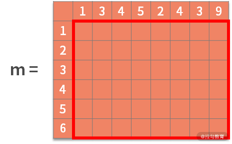
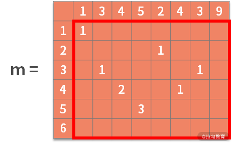

# 16 | 真题案例（一）：算法思维训练

2020/07/08 公瑾

 

你好，欢迎进入第 16 课时的学习。在前面课时中，我们已经学习了解决代码问题的方法论。宏观上，它可以分为以下 4 个步骤：

1. **复杂度分析**。估算问题中复杂度的上限和下限。
2. **定位问题**。根据问题类型，确定采用何种算法思维。
3. **数据操作分析**。根据增、删、查和数据顺序关系去选择合适的数据结构，利用空间换取时间。
4. **编码实现**。


复杂度分析  

定位问题

数据操作分析

编码实现 

这套方法论的框架，是解决绝大多数代码问题的基本步骤。本课时，我们将在一些更开放的题目中进行演练，继续训练你的算法思维。


### 算法思维训练题

#### 例题 1：斐波那契数列

斐波那契数列是：0，1，1，2，3，5，8，13，21，34，55，89，144……。你会发现，这个数列中元素的性质是，某个数等于它前面两个数的和；也就是 a[n+2] = a[n+1] + a[n]。至于起始两个元素，则分别为 0 和 1。**在这个数列中的数字，就被称为斐波那契数**。

**【题目】写一个函数，输入 x，输出斐波那契数列中第 x 位的元素**。例如，输入 4，输出 2；输入 9，输出 21。要求：需要用递归的方式来实现。

**【解析】** 在本课时开头，我们复习了解决代码问题的方法论，下面我们按照解题步骤进行详细分析。

- 首先我们还是先做好复杂度的分析

题目中要求要用递归的方式来实现，而递归的次数与 x 的具体数值有非常强的关系。因此，此时的时间复杂度应该是关于输入变量 x 的数值大小的函数。

- 至于问题定位

因为题目中已经明确了要采用递归去解决。所以也不用再去做额外的分析和判断了。

那么，如何使用递归呢？我们需要依赖斐波那契数列的重要性质“某个数等于它前面两个数的和”。也就是说，要求出某个位置 x 的数字，需要先求出 x-1 的位置是多少和 x-2 的位置是多少。递归同时还需要终止条件，对应于斐波那契数列的性质，就是起始两个元素，分别为 0 和 1。

- 数据操作方面

斐波那契数列需要对数字进行求和。而且所有的计算，都是依赖最原始的 0 和 1 进行。因此，这道题是不需要设计什么复杂的数据结构的。

- 最后，实现代码

我们围绕递归的性质进行开发，去试着写出递归体和终止条件。代码如下：

复制

```
public static void main(String[] args) {
    int x = 20;
    System.out.println(fun(x));
}
private static int fun(int n) {
    if (n == 1) {
        return 0;
    }
    if (n == 2) {
        return 1;
    }
    return fun(n - 1) + fun(n - 2);
}
```

**下面，我们来对代码进行解读**。

**主函数中**，第 1 行到第 4 行，定义输入变量 x，并调用 fun(x) 去计算第 x 位的斐波那契数列元素。

**在 fun() 函数内部**，采用了递归去完成计算。递归分为递归体和终止条件：

- 递归体是第 13 行。即当输入变量 n 比 2 大的时候，递归地调用 fun() 函数，并传入 n-1 和 n-2，即 return fun(n - 1) + fun(n - 2)；
- 终止条件则是在第 7 行到第 12 行，分别定义了当 n 为 1 或 2 的时候，直接返回 0 或 1。

#### 例题2：判断一个数组中是否存在某个数

**【题目】给定一个经过任意位数的旋转后的排序数组，判断某个数是否在里面**。

例如，对于一个给定数组 {4, 5, 6, 7, 0, 1, 2}，它是将一个有序数组的前三位旋转地放在了数组末尾。假设输入的 target 等于 0，则输出答案是 4，即 0 所在的位置下标是 4。如果输入 3，则返回 -1。

**【解析】** 这道题目依旧是按照解决代码问题的方法论的步骤进行分析。

- 先做复杂度分析

这个问题就是判断某个数字是否在数组中，因此，复杂度极限就是全部遍历地去查找，也就是 O(n) 的复杂度。

- 接着，进入定位问题的环节中

这个问题有很多关键字，因此能够让你立马锁定问题。例如，判断某个数是否在数组里面，这就是一个查找问题。

- 然后，我们来做数据操作分析

原数组是经过某些处理的排序数组，也就是说原数组是有序的。有序和查找，你就会很快地想到，这个问题极有可能用二分查找的方式去解决，时间复杂度是 O(logn)，相比上面 O(n) 的基线也是有显著的提高。

在利用二分查找时，更多的是判断，基本没有数据的增删操作，因此不需要太多地定义复杂的数据结构。

分析到这里，解决方案已经非常明朗了，就是采用二分查找的方法，在 O(logn) 的时间复杂度下去解决这个问题。二分查找可以通过递归来实现。**而每次递归的关键点在于，根据切分的点（最中间的那个数字），确定是向左走还是向右走。这也是这个例题中唯一的难点了**。

试想一下，在一个旋转后的有序数组中，利用中间元素作为切分点得到的两个子数组有什么样的性质。经过枚举不难发现，这两个子数组中，一定存在一个数组是有序的。也可能出现一个极端情况，二者都是有序的。如下图所示：


对于有序的一边，我们是很容易判断目标值，是否在这个区间内的。如果在其中，也说明了目标值不在另一边的旋转有序组里；反之亦然。

当我们知道了目标值在左右哪边之后，就可以递归地调用旋转有序的二分查找了。之所以可以递归调用，是因为，对于旋转有序组，这个问题和原始问题完全一致，可以调用。对于有序组，它是旋转有序的特殊情况（即旋转 0 位），也一定是可以通过递归的方法去实现查找的。直到不断二分后，搜索空间只有 1 位数字，直接判断是否找到即可。

- 最后，实现代码

我们给出这个例子的实现代码，如下：

复制

```
public static void main(String[] args) {
    int[] arr = { 4, 5, 6, 7, 0, 1, 2 };
    int target = 7;
    System.out.println(bs(arr, target, 0, arr.length-1));
}
private static int bs(int[] arr, int target, int begin, int end) {
    if (begin == end) {
        if (target == arr[begin]){
            return begin;
        }
        else{
            return -1;
        }
    }
    int middle = (begin + end)/2;
    if (target == arr[middle]) {
        return middle;
    }
    if (arr[begin] <= arr[middle-1]){
        if (arr[begin] <= target && target <= arr[middle-1]) {
            return bs(arr,target, begin,middle-1);
        } else {
            return bs(arr,target, middle+1,end);
        }
    }
    else {
        if (arr[middle+1] <= target && target <= arr[end]) {
            return bs(arr,target, middle+1,end);
        } else {
            return bs(arr,target, begin,middle-1);
        }
    }
}
```

**我们对代码进行解读：**

**主函数中，第 2 到 4 行。定义数组和 target，并且执行二分查找**。二分查找包括两部分，其一是二分策略，其二是终止条件。

**二分策略在代码的 16～33 行：**

- 16 行计算分裂点的索引值。17 到 19 行，进行目标值与分裂点的判断。
  - 如果相等，则查找到结果并返回；
  - 如果不等就要继续二分。
- 在二分的过程中，第 20 行进行了左右子数组哪边是有序的判断。
  - 如果左边有序，则进入到 21 到 25 行；
  - 如果右边有序，则进入到 28 到 32 行。
- 假设左边有序，则还需要判断 target 是否在有序区间内，这是在第 21 行。
  - 如果在，则继续递归的调用 bs(arr,target, begin,middle-1)；
  - 如果不在有序部分，则说明 target 在另一边的旋转有序中，则调用 bs(arr,target, middle+1,end)。

下面的逻辑与此类似，不再赘述。

**经过了层层二分，最终 begin 和 end 变成了相等的两个变量，则进入到终止条件，即 8 到 15 行**。

- 在这里，需要判断最后剩下的 1 个元素是否与 target 相等：
  - 如果相等则返回索引值；
  - 如果不等则返回 -1。

#### 例题3：求解最大公共子串

**【题目】输入两个字符串，用动态规划的方法，求解出最大公共子串**。

例如，输入 a = "13452439"， b = "123456"。由于字符串"345"同时在 a 和 b 中出现，且是同时出现在 a 和 b 中的最长的子串。因此输出"345"。

**【解析】这里已经定义了问题，就是寻找最大公共子串。同时也定义了方法，就是要用动态规划的方法**。那么我们也不需要做太多的分析，只要依赖动态规划的步骤完成就可以了。

首先，我们回顾一下先前学过的最短路径问题。在最短路径问题中，我们是定义了起点和终点后，再去寻找二者之间的最短路径。

而现在的最大公共子串问题是，所有相邻的字符距离都是 1，在不确定起点和终点时，我们需要去寻找起点和终点之间最远的距离。

如果要基于已有的知识来探索陌生问题，那就需要根据每个可能的公共子串起点，去寻找与之对应的最远终点。这样就能得到全部的子串。随后再从中找到最大的那个子串。

别忘了，**动态规划的基本方法是：分阶段、找状态、做决策、状态转移方程、定目标、寻找终止条件**。下面我们来具体分析一下动态规划的步骤：

- 对于一个可能的起点，它后面的每个字符都是一个阶段。
- 状态就是当前寻找到的相匹配的字符。
- 决策就是当前找到的字符是否相等（相等则进入到公共子串中）。
- 状态转移方程可以写作 sk+1 = uk(sk)。可以理解为，如果 sk = "123"是公共子串，且在 a 字符串和 b 字符串中，"123"后面的字符相等，假设为"4"，则决策要进入到公共子串中，sk+1 = "1234"。
- 目标自然就是公共子串最长。
- 终止条件就是决策到了不相等的结果。

这段分析对于初学者来说会非常难懂，接下来我们给一个实现的流程来辅助你理解。

**我们在最短路径问题中，曾重点提到的一个难点是，对于输入的图，采用什么样的数据结构予以保存。最终我们选择了二维数组**。

在这个例子中也可以采用二维数组。每一行或每一列就对应了输入字符串 a 和 b 的每个字符，即 6 x 8 的二维数组（矩阵）为：



接着，每个可能的起点字符，都应该同时出现在字符串 a 和 b 中，例如"1"就是一个可能的起点。如果以"1"作为起点，那么它后面的字符就是阶段，显然下个阶段就是 a[1] = 3 和 b[1] = 2。而此时的状态就是当前的公共子串，即 "1"。

决策的结果是，下一个阶段是否进入到公共子串中。很显然 a[1] 不等于 b[1]，因此决策的结果是不进入。这也同时命中了终止条件。如果以"3"起点，则因为它之后的 a[2] 等于 b[3]，则决策结果是进入到公共子串。

因此状态转移方程 sk+1 = uk(sk)，含义是在"3"的状态下决策"4"进入子串，结果得到"34"。我们的目标是寻找最大的公共子串，因此可以用从 1 开始的数字定义距离（子串的长度）。具体步骤如下：

对于每个可能的起点，距离都是 1 （不可能的起点置为 0，图中忽略未写）。则有：


接着利用状态转移方程，去寻找最优子结构。也就是，如果 b[i] = a[j]，则 m[i,j] = m[i-1,j-1] + 1。含义为，如果决策结果是相等，则状态增加一个新的字符，进行更新。可以得到：



最终，检索这个矩阵，得到的最大数字就是最大公共子串的长度。根据其所在的位置，就能从 a 或 b 中找到最大公共子串。

代码如下：

复制

```
public static void main(String[] args) {
    String a = "13452439";
    String b = "123456";
    getCommenStr(a, b);
}
public static void getCommenStr(String a, String b) {
    char[] c1 = a.toCharArray();
    char[] c2 = b.toCharArray();
    int[][] m = new int[c2.length+1][c1.length+1];
    for (int i = 1; i <= c2.length; i++) {
        for (int j = 1; j <= c1.length; j++) {
            if (c2[i - 1] == c1[j - 1])
                m[i][j] = m[i - 1][j - 1] + 1;
        }
    }
    int max = 0;
    int index = 0;
    for (int i = 0; i <= c2.length; i++) {
        for (int j = 0; j <= c1.length; j++) {
            if (m[i][j] > max) {
                max = m[i][j];
                index = i;
            }
        }
    }
    String s = "";
    for (int i = index - max; i < index; i++)
        s += b.charAt(i);
    System.out.println(s);
}
```

**下面我们对代码进行解读：**

主函数中定义了字符串 a 和字符串 b，随后调用动态规划代码。

进入 getCommenStr() 函数中之后，首先在第 10 行定义了二维数组。此时二维数组的维数是 7 x 9 的。这主要的原因是，后续会需要用到第一行和第一列的全零向量，作为起始条件。

接着，在第 11～16 行，利用双重循环去完成状态转移的计算。此时就得到了最关键的矩阵，如下所示：


随后的 17～26 行，我们从矩阵 m 中，找到了最大值为 3，在字符串 b 中的索引值为 4（此时 index 为 5，但别忘了我们之前额外定义了一行/一列的全零向量）。

最后，27～30 行，我们根据终点字符串索引值 4 和最大公共子串长度 3，就能找到最大公共子串在 b 中的 2～4 的位置。即 "345"。

### 总结

这一课时中，我们对例题做了详细的分析和讲解，重点其实是训练你的算法思维。为了检验你的学习成果，我们基于斐波那契数列的例题，再给出一个**思考题，题目如下**：

**如果现在是个线上实时交互的系统。客户端输入 x，服务端返回斐波那契数列中的第 x 位。那么，这个问题使用上面的解法是否可行**。

这里给你一个小提示，既然我这么问，答案显然是不可行的。如果不可行，原因是什么呢？我们又该如何解决？注意，题目中给出的是一个实时系统。当用户提交了 x，如果在几秒内没有得到系统响应，用户就会卸载 App 啦。

 

15 | 定位问题才能更好地解决问题：开发前的复杂度分析与技术选型

00:19

 重学数据结构与算法

#  精选留言

写留言
**鸣
right-icon
1
你成功的勾起了，我对数据结构和算法的兴趣。😉
*巍
right-icon
不行，因为当前递归调用过程中，每次都进行了重复计算，拖慢了整个过程。我们可以将上一步（n-1 步）计算的值缓存起来
**8836
right-icon
如果现在是个线上实时交互的系统。n如果过大，可能会导致超时。建议使用动态规划的解法。int fib(int n){ }}
*鑫
right-icon
递归方法，数字一大，就会变得很慢。亲测输入50结果： 12586269025 耗时59746ms 。用户肯定无法接受 嘻嘻